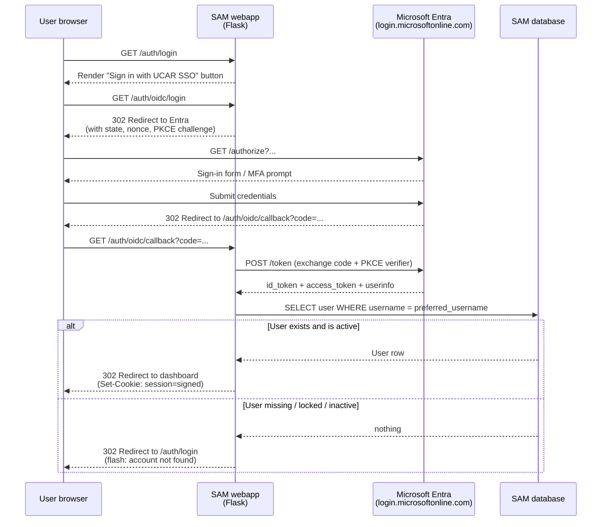

# Authentication & SSO

How users sign in to SAM Queries -- written for the curious, not just the
on-call. If you've never touched OIDC before, start at the top. If you
just need to rotate a secret, jump straight to [Operations](#operations).

> **TL;DR**: Real users sign in with their UCAR account through Microsoft
> Single Sign-On. Behind the scenes, that's OIDC (OpenID Connect) talking
> to Microsoft Entra. Locally and in tests, we skip all of that with a
> stub provider so developers don't have to deal with login during
> day-to-day work. Where the secrets live and how the app finds them
> depends on which deployment you're looking at -- there's a matrix
> further down.

---

## What you see as a user

You're a CISL staff member. You point your browser at one of our
deployments (e.g. `https://samuel.k8s.ucar.edu`). What happens?

1. **You land on a login page.** Nothing fancy -- just a button that
   says "Sign in with UCAR SSO". No username, no password fields. If
   you've ever clicked "Continue with Google" on a third-party website,
   it's the same idea.

2. **You click the button.** Your browser bounces over to
   `login.microsoftonline.com` -- Microsoft's sign-in page. If you're
   already signed in to your UCAR account (because you used Outlook or
   Teams earlier today), this might flash by so fast you don't notice
   it. Otherwise you'll see Microsoft's standard sign-in form. UCAR's
   normal MFA rules apply -- Authenticator app prompts, conditional
   access, the works.

3. **Microsoft signs you in and bounces you back.** Your browser ends
   up at `https://samuel.k8s.ucar.edu/auth/oidc/callback` with a
   one-time code. The SAM webapp swaps that code for an ID token,
   reads your username out of the token, looks you up in the SAM
   database, and creates a session.

4. **You're in.** You see either the user dashboard or the admin
   dashboard, depending on your POSIX group memberships -- the same
   group memberships that decide everything else in SAM.

5. **You log out.** Clicking "Logout" in the nav bar clears the SAM
   session AND bounces you to Microsoft's sign-out page so the next
   person who uses the browser doesn't inherit your Entra session.

### What if I'm not in SAM?

If your Microsoft sign-in succeeds but your username doesn't match an
active SAM user record, you'll see "Your account was not found in SAM
or is inactive" and bounce back to the login page. We don't
auto-provision accounts -- this is intentional. Being a UCAR employee
isn't enough; you have to also be in the SAM database. Talk to a SAM
admin if you think this is wrong.

### What about logging in locally?

When you run the app on your laptop with `docker compose up` or
`helm install -f values-local.yaml`, you don't see the login screen at
all -- the app auto-logs you in as a test user (`benkirk` by default,
configurable via `DEV_AUTO_LOGIN_USER`). This is intentional. Local dev
shouldn't depend on Microsoft being reachable, and we don't want
developers's laptops talking to UCAR's identity provider with shared
production credentials. See [Local development](#local-development) for
how to opt into a "real" OIDC flow if you ever need to debug a
Microsoft-side issue.

---

## What's actually happening (the technical flow)



The four moving pieces:

- **The browser** -- holds the session cookie after login. The cookie
  is signed by `FLASK_SECRET_KEY` so it can't be forged.
- **The Flask webapp** -- uses the [Authlib](https://docs.authlib.org/)
  library to talk OIDC. The relevant code lives in
  [`src/webapp/auth/blueprint.py`](../src/webapp/auth/blueprint.py)
  (the routes) and
  [`src/webapp/auth/providers.py`](../src/webapp/auth/providers.py)
  (the OIDC claim-to-SAM-user mapping).
- **Microsoft Entra** -- UCAR's identity provider. We have an "app
  registration" there that lists which URLs we're allowed to redirect
  back to, what scopes we ask for, and a client secret we use to prove
  it's really us during the code exchange.
- **The SAM database** -- the source of truth for who counts as a
  valid user. The OIDC layer just authenticates; SAM still authorizes.

### What the app uses to make this work

A handful of environment variables, all read at startup:

| Variable | What it does |
|---|---|
| `AUTH_PROVIDER` | `oidc` to enable SSO; `stub` for dev (any password works) |
| `OIDC_CLIENT_ID` | Identifies our app to Entra |
| `OIDC_CLIENT_SECRET` | Proves our app to Entra during the token exchange |
| `OIDC_ISSUER` | Where to discover all the Entra endpoints (e.g. `https://login.microsoftonline.com/{tenant}/v2.0`) |
| `OIDC_REDIRECT_URI` | The exact URL Entra should bounce users back to after login (must match what's registered on the Entra app) |
| `OIDC_USERNAME_CLAIM` | Which OIDC claim contains the SAM username (default: `preferred_username`) |
| `OIDC_SCOPES` | What we ask Entra for (default: `openid email profile`) |
| `FLASK_SECRET_KEY` | Signs the session cookie. Per-deployment, never shared |
| `FLASK_CONFIG` | `production` enables `SESSION_COOKIE_SECURE=True` (HTTPS-only cookies) |

In production deployments, `OIDC_CLIENT_ID`, `OIDC_CLIENT_SECRET`,
`OIDC_ISSUER`, and `FLASK_SECRET_KEY` are pulled from a secret store
(AWS SSM for ECS, OpenBao for Kubernetes) -- never written into git or
Docker images. The other values are plain config.

---

## Where it runs (the deployment matrix)

Same code, four deployment shapes. The only thing that changes is
*where* the OIDC config comes from.

| Deployment | URL | How auth works | OIDC creds source | Reply URL on Entra |
|---|---|---|---|---|
| **Local Docker Compose** (`docker compose up webdev`) | `http://localhost:5050` | Stub auto-login (`DISABLE_AUTH=1`) | n/a | n/a |
| **Local k8s** (Docker Desktop, `values-local.yaml`) | port-forwarded | Stub auto-login (`DISABLE_AUTH=1`) | n/a | n/a |
| **Fargate staging** | `https://sam-staging.csgsam.ucar.edu` | OIDC | AWS SSM `/sam/staging/oidc-*` | `https://sam-staging.csgsam.ucar.edu/auth/oidc/callback` |
| **CIRRUS k8s** (samuel) | `https://samuel.k8s.ucar.edu` | OIDC | OpenBao `csg/sam-oidc` | `https://samuel.k8s.ucar.edu/auth/oidc/callback` |
| Future ECS production | tbd | OIDC | AWS SSM `/sam/production/oidc-*` | tbd |
| Future k8s staging | tbd | OIDC | OpenBao `csg/sam-staging-oidc` | tbd |

### Why two paths to OIDC?

Two different deployment platforms (AWS ECS vs Kubernetes on CIRRUS),
two different secret stores. They don't share infrastructure -- they
share *only* the Entra app registration. As of this writing, both
deployments use the same Entra app (so the same `client_id`/
`client_secret`/`issuer` flows into both via different stores). Before
we stand up an ECS production environment, we plan to ask UCAR IT for
a separate Entra app per environment so a leak in staging can't
affect production.

### How the secrets get into the app

**On Fargate** (ECS, staging today):

```
Terraform writes -> AWS SSM (SecureString)
                        v
ECS task definition references SSM ARN in its `secrets` block
                        v
ECS injects values as env vars into the container at task start
                        v
Flask reads from os.environ at startup
```

**On Kubernetes** (CIRRUS, samuel.k8s.ucar.edu):

```
Operator writes -> OpenBao (csg/sam-oidc path)
                        v
External Secrets Operator (every 1h) reads OpenBao
                        v
ESO creates/updates the k8s Secret `samuel-oidc-credentials`
                        v
Pod env block references that Secret via secretKeyRef
                        v
Flask reads from os.environ at startup
```

Either way, the Flask app sees plain environment variables. The
plumbing differs entirely depending on which platform you deploy to.

---

## Local development

Most of the time you don't think about authentication locally -- it's
out of your way by design.

### What you'll see in normal local development

```bash
# Start everything
docker compose up

# Browse to http://localhost:5050
# You're auto-logged in as benkirk (or whoever DEV_AUTO_LOGIN_USER says).
# No login page, no password, no Microsoft involvement.
```

This works because `compose.yaml` sets `DISABLE_AUTH=1`, which
activates a small Flask middleware
([`src/webapp/utils/dev_auth.py`](../src/webapp/utils/dev_auth.py))
that auto-authenticates every request as the configured user via the
stub provider. The stub provider accepts any password for any active
SAM user -- never run it in production.

To impersonate a different user locally:

```bash
# In .env or as a docker compose env override:
DEV_AUTO_LOGIN_USER=someone_else
```

### Running real OIDC locally (rare)

You should only need this if you're debugging a Microsoft-side issue
(token-format weirdness, claim-mapping bug, etc.). For everyday
development, **stay on stub**.

If you really need to:

1. **Get a separate dev Entra app from UCAR IT.** Do *not* use the
   shared staging/production app. Ask IT for a new "SAM dev" app
   registration with redirect URI
   `http://localhost:5050/auth/oidc/callback`. (Microsoft Entra allows
   `http://localhost` as a special exception for confidential apps;
   most other IdPs don't.)

2. **Add to your `.env`** (these are the placeholders in
   [`.env.example`](../.env.example)):

   ```bash
   AUTH_PROVIDER=oidc
   OIDC_CLIENT_ID=<dev-app-client-id>
   OIDC_CLIENT_SECRET=<dev-app-client-secret>
   OIDC_ISSUER=https://login.microsoftonline.com/{tenant}/v2.0
   OIDC_REDIRECT_URI=http://localhost:5050/auth/oidc/callback
   FLASK_CONFIG=development
   ```

3. **Pass these envs through to the container.** `compose.yaml`
   doesn't forward them by default (intentional, to avoid silent
   misconfigurations). Either edit the `webdev` service's `environment`
   block to add them, or use:

   ```bash
   docker compose run -e AUTH_PROVIDER -e OIDC_CLIENT_ID -e OIDC_CLIENT_SECRET \
     -e OIDC_ISSUER -e OIDC_REDIRECT_URI -e FLASK_CONFIG webdev
   ```

`FLASK_CONFIG=development` is important here -- it keeps
`SESSION_COOKIE_SECURE=False` so the session cookie can ride over plain
HTTP on `localhost`. With `FLASK_CONFIG=production`, the browser will
silently drop the cookie and login will appear to "succeed" then
immediately bounce back to the login page. Confusing failure mode;
worth knowing.

### Local Kubernetes

Same idea but with `helm install -f values-local.yaml`. The local
values file pins `DISABLE_AUTH=1` and `oidcCredentials.enabled=false`
so the chart skips the OpenBao-based ExternalSecret entirely. You
won't be able to opt into real OIDC on local k8s without manually
creating a `samuel-oidc-credentials` Kubernetes Secret and flipping
the values back on. We chose not to support this in the chart; if you
need to test the chart's OIDC wiring, exercise it via the helm
template render assertions
([`helm/tests/test-oidc-render.sh`](../helm/tests/test-oidc-render.sh))
rather than a live local cluster.

---

## Operations

### Where each secret lives, by environment

| What | Fargate (staging) | k8s (samuel) |
|---|---|---|
| OIDC client ID | AWS SSM `/sam/staging/oidc-client-id` | OpenBao `csg/sam-oidc.client_id` |
| OIDC client secret | AWS SSM `/sam/staging/oidc-client-secret` | OpenBao `csg/sam-oidc.client_secret` |
| OIDC issuer URL | AWS SSM `/sam/staging/oidc-issuer` | OpenBao `csg/sam-oidc.issuer` |
| Flask session key | AWS SSM `/sam/staging/flask-secret-key` | OpenBao `csg/sam-oidc.flask_secret_key` |

Both stores require auth. AWS SSM is gated by IAM (the `terraform`
user can read/write under `/sam/`); OpenBao is gated by the team's
internal access policies. No human should ever paste these values into
git or Slack.

### Reading staging values (when needed for ops)

```bash
# Requires AWS CLI configured against the project account (842264312439)
aws ssm get-parameter --with-decryption \
  --name /sam/staging/oidc-client-id \
  --query Parameter.Value --output text
```

You can also use the project AWS MCP from Cursor with the same
operation -- preferred when you're investigating without leaving the
IDE.

### Rotating the Entra client secret

This is the most common rotation scenario.

1. **Generate a new secret in Microsoft Entra.** UCAR IT does this on
   the app registration's "Certificates & secrets" page. They'll send
   you the new value via a secure channel.
2. **Update both secret stores.** They must be updated together, or
   one deployment will start failing.

   ```bash
   # AWS SSM (staging Fargate)
   aws ssm put-parameter --name /sam/staging/oidc-client-secret \
     --type SecureString --overwrite --value '<new-secret>'

   # OpenBao (samuel k8s) -- via your team's normal OpenBao tooling.
   # Update csg/sam-oidc.client_secret to the new value.
   ```

3. **Restart the apps so they pick up the new value.**

   ```bash
   # Fargate -- new task definition revision picks up SSM at task start
   aws ecs update-service --cluster sam-staging --service sam-staging-webapp \
     --force-new-deployment

   # k8s -- ExternalSecret refreshes hourly; force immediately:
   kubectl annotate externalsecret samuel-oidc-credentials-esos -n <ns> \
     force-sync=$(date +%s) --overwrite
   kubectl rollout restart deployment/samuel -n <ns>
   ```

4. **Test the login flow on both URLs.** Don't trust that "the pod
   restarted, so it must work". Click through to confirm.

If you forget step 3, the old client_secret stays in the running
process's memory and you won't notice the rotation worked until the
next pod restart -- or worse, until a deploy fails.

### Adding a new redirect URI (e.g. a new deployment hostname)

UCAR IT adds it to the existing Entra app registration. No code change
needed. You just need to:

1. **File a ticket** asking for the new reply URL on the existing app.
   See `infrastructure/README.md` "OIDC SSO Integration" section for
   the IT handoff checklist.
2. **Once IT confirms**, set `OIDC_REDIRECT_URI` to the new URL in the
   relevant deployment config (`infrastructure/staging/ecs.tf` for
   Fargate, `helm/values.yaml` for k8s).
3. **Redeploy.**

### Common failure modes

| Symptom | Likely cause | Fix |
|---|---|---|
| Login bounces to Entra error: "AADSTS50011 reply URL mismatch" | `OIDC_REDIRECT_URI` doesn't exactly match what's registered on the Entra app (trailing slash, http vs https, typo) | Compare byte-for-byte with the value on the app's "Authentication" blade |
| Login bounces back to `/auth/login` immediately after Entra success | `FLASK_CONFIG=production` set but the browser is on HTTP, so it dropped the `Secure` cookie | Ensure HTTPS is in front (or use `FLASK_CONFIG=development` for HTTP-only deployments) |
| Login bounces with "account not found in SAM or is inactive" | The username from `preferred_username` doesn't match an active row in the `users` table | Check the username in SAM (`sam-search user <username>`); confirm `active=1` and `locked=0` |
| App fails to start with `EnvironmentError: missing required env vars` | `AUTH_PROVIDER=oidc` but one of `OIDC_CLIENT_ID`, `OIDC_CLIENT_SECRET`, `OIDC_ISSUER` is empty | Check the secret store; confirm pod/task env actually has the values (`kubectl exec` / `aws ecs describe-tasks`) |
| `kind: ExternalSecret` exists but `samuel-oidc-credentials` k8s Secret never appears | OpenBao path or property name typo, or ESO can't reach OpenBao | `kubectl describe externalsecret samuel-oidc-credentials-esos` shows the error in `Status.Conditions` |
| Logout fails with Entra error | `post_logout_redirect_uri` isn't allowlisted on the Entra app | Ask IT to add it; it's the same form as adding a reply URL |

### Logs to check

```bash
# k8s
kubectl logs -n <ns> -l app=samuel | grep -E '(OIDC|auth|login)'

# Fargate
aws logs tail /ecs/sam-staging-webapp --since 30m --filter-pattern OIDC
```

The app emits an info log line on each successful and failed login,
which is usually the fastest way to confirm whether the issue is at
the OIDC layer or the SAM authorization layer.

---

## Security

What we worry about, what we don't, and why.

### What protects users

- **HTTPS everywhere** in production. Session cookies are marked
  `Secure; HttpOnly; SameSite=Lax` so they can't be sniffed in transit
  or stolen by JavaScript.
- **Per-environment session keys.** Each deployment has its own
  `FLASK_SECRET_KEY` -- a session minted in staging cannot be replayed
  against the k8s deployment, and vice versa.
- **Microsoft handles the actual authentication.** UCAR's MFA rules,
  conditional access policies, password complexity, and account
  lockout all apply transparently. We never see the user's password
  and don't need to.
- **PKCE on the auth code flow.** Even if the authorization code
  leaked from the URL bar, an attacker can't exchange it for a token
  without the code verifier we generated client-side.
- **State and nonce parameters** prevent CSRF and token-replay
  attacks. Authlib handles these automatically.
- **No auto-provisioning.** A valid Microsoft token isn't enough --
  the user has to also exist in SAM and be active. If someone leaves
  CISL, removing them from the SAM database revokes their access
  immediately, even if their UCAR account is still alive.
- **Open-redirect protection.** The `?next=` query param is validated
  to reject external hosts (no `?next=https://evil.com/`), tested at
  [`tests/unit/test_oidc_auth.py`](../tests/unit/test_oidc_auth.py)
  lines 319-353.
- **VPN gating.** The Fargate ALB is restricted to the UCAR VPN CIDR
  (`128.117.0.0/16`); samuel.k8s.ucar.edu is internal-ingress only.
  External attackers can't even reach the login page.

### What we worry about (and what we're doing)

- **Shared Entra app between staging and samuel.** Today the same
  client_secret protects both. A compromise of either secret store
  compromises both. Mitigation: when production lands, we'll register
  a separate Entra app per environment.
- **Session cookies aren't encrypted, just signed.** A user holding
  their own cookie can read its contents -- but they're already
  authenticated, so that's not a leak vector. A network attacker
  *cannot* read it (HTTPS) or forge it (`FLASK_SECRET_KEY` is per-env
  and 32 bytes random).
- **Logout doesn't fully clear the Flask session.** Flask-Login's
  `logout_user()` clears the user ID but leaves any other session keys
  (`oidc_next`, etc.) in place. Low risk -- nothing sensitive is
  stored there -- but tracked as a hardening follow-up.

### What we don't worry about (and why)

- **Brute-force on the login page.** There isn't one to brute-force --
  it's a button. Microsoft handles password attempts, and the VPN
  gates external access anyway.
- **CSRF on the OIDC routes.** They're GET-initiated and protected by
  the OIDC `state` parameter (handled by Authlib).
- **Leaked secrets in git.** `.env`, `secrets.auto.tfvars`, and
  `.cursor/mcp.json` are all gitignored. Pre-commit hooks
  (TruffleHog + GitGuardian) catch accidental commits before they
  push. CI rejects PRs with secrets verified against known patterns.

---

## Future plans

In rough priority order:

1. **Per-environment Entra app registrations.** Before
   `infrastructure/production/` exists, ask UCAR IT to register a
   separate `sam-production` app. This isolates blast radius and
   simplifies audit. The app-side change is zero (the chart and
   Terraform already read environment-specific paths); the IT-side
   change is a new app registration.
2. **`FLASK_CONFIG=production` on Fargate staging.** Currently unset
   on staging Fargate, so it runs `DevelopmentConfig` (DEBUG=True,
   `SESSION_COOKIE_SECURE=False`). Masked today because staging is
   HTTP-only behind UCAR VPN. Will need to be set when HTTPS is added
   on staging (see
   [`.cursor/rules/infrastructure-overview.mdc`](../.cursor/rules/infrastructure-overview.mdc)
   "DNS Subdomain Readiness Checklist" item #2).
3. **Mock OIDC IdP for integration tests.** Today the tests at
   [`tests/unit/test_oidc_auth.py`](../tests/unit/test_oidc_auth.py)
   mock Authlib at the function boundary -- they catch code-path
   regressions but don't validate the actual OIDC protocol round-trip.
   Adding a `dexidp/dex` or `navikt/mock-oauth2-server` Docker service
   to the test compose profile would let us drive the full flow
   against a fake IdP.
4. **`session.clear()` on logout.** One-line hardening.
5. **HTTPS on Fargate staging (DNS dependency).** Awaiting UCAR DNS
   team for the staging subdomain CNAME. Once that lands, we can
   request an ACM cert and flip the ALB listener from HTTP to HTTPS.

None of these block the current k8s deployment.

---

## Glossary

A few terms that get used a lot:

- **OIDC** -- OpenID Connect. The standardized protocol that lets a
  web app delegate "who is this user" to a third-party identity
  provider. Built on top of OAuth 2.0.
- **IdP / Identity Provider** -- the system that authenticates users.
  For us, that's Microsoft Entra (Azure AD).
- **Entra / Azure AD** -- Microsoft's identity service. UCAR uses it
  for staff accounts. Same login as Outlook, Teams, etc.
- **App Registration** -- a record in Entra that says "this web app
  is allowed to authenticate users; here are its callback URLs and
  here's a secret it'll use to prove its identity".
- **Client ID / Client Secret** -- a non-secret identifier and a
  secret password that together identify our app to Entra. Issued by
  IT when they register the app.
- **Issuer** -- a URL that points at Entra's metadata document; the
  app uses it to discover all the other endpoints (authorize, token,
  end_session, etc.).
- **Redirect URI / Reply URL** -- the exact URL Entra sends users to
  after they log in. Must match a value registered on the app.
- **PKCE** (pronounced "pixie") -- Proof Key for Code Exchange. An
  extra layer of protection on the authorization-code flow that
  prevents a stolen code from being usable.
- **Authlib** -- the Python OIDC library we use. Hides most of the
  protocol mechanics behind a few function calls.
- **External Secrets Operator (ESO)** -- a Kubernetes addon that
  syncs secrets from an external store (OpenBao for us) into native
  Kubernetes Secrets, refreshed on a schedule.
- **OpenBao** -- UCAR's internal HashiCorp-Vault-compatible secret
  store. The k8s deployment reads OIDC creds from here.
- **AWS SSM Parameter Store** -- AWS's managed key-value store for
  config and secrets. The Fargate deployment reads OIDC creds from
  here.
- **Stub provider** -- the dev-mode auth provider that accepts any
  password for any active SAM user. Used locally and in tests; never
  in production.

---

## Where to look for more

- [`infrastructure/README.md`](../infrastructure/README.md) -- the
  Terraform side of staging, including the IT handoff checklist for
  registering an OIDC app.
- [`docs/README-k8s.md`](README-k8s.md) -- Helm chart deployment guide
  with the per-environment matrix and force-sync runbook.
- [`docs/STAGING.md`](STAGING.md) -- staging Fargate access and
  deployment.
- [`docs/WEBAPP_SETUP.md`](WEBAPP_SETUP.md) -- local webapp setup.
- [`src/webapp/auth/blueprint.py`](../src/webapp/auth/blueprint.py) --
  the routes (`/auth/login`, `/auth/oidc/login`, `/auth/oidc/callback`,
  `/auth/logout`).
- [`src/webapp/auth/providers.py`](../src/webapp/auth/providers.py) --
  the `OIDCAuthProvider` claim-to-user mapping.
- [`tests/unit/test_oidc_auth.py`](../tests/unit/test_oidc_auth.py) --
  46 tests covering the full auth surface.
