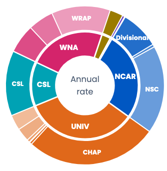
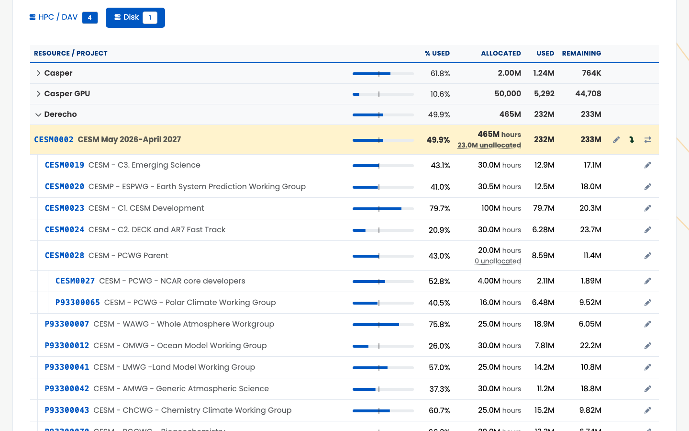

# Concepts

Users, projects, resources, allocations, and usage tracking.

## SAM in one sentence {.vcenter scale="1.15"}

- **Who** may compute, **on what**, **how much** they can use, and **where did usage come from**.
- Everything else is a view of those answers: the dashboards, the APIs, the scheduled tasks,
  the LDAP feed, PBS's fairshare tree.
- This part is the model, in words and pictures. Part 3 shows the tables.

*† SQL specifics are deferred to Part 3.*

::: {.notes}
Part 1 said what SAMuel is for; this part is the vocabulary every later slide assumes. The
order matters: people, projects, resources, then the accounts that join them, then money
(allocations and charges), then access, then trees.
:::

## The concepts & linkage

::: {.notes}
Not the schema: Part 3 has the generated ER diagrams. A project holds
one account per resource; users are authorized on accounts, not on
projects; allocations live on accounts; charges draw them
down. Projects and allocations each have a parent, so both form trees.
In this way users join projects indirectly, as authorized individuals
who can use an allocation on an account. This borrows heavily from a
banking model.
:::

```{dot}
//| fig-width: 10
digraph Concepts {
  graph [rankdir=LR, nodesep=0.35, ranksep=0.9, bgcolor="transparent",
         fontname="Helvetica", fontsize=13, fontcolor="#00357A"];
  node  [shape=box, style="rounded,filled", fontname="Helvetica", fontsize=14,
         fillcolor="#E6F0FA", color="#0057C2", fontcolor="#00357A"];
  edge  [fontname="Helvetica", fontsize=11, color="#6B7280", fontcolor="#6B7280"];

  user     [label="User"];
  project  [label=<Project<BR/><FONT POINT-SIZE="10" COLOR="#6B7C99">lead (PI), admin,<BR/>facility, type, metadata</FONT>>];
  resource [label=<Resource<BR/><FONT POINT-SIZE="10" COLOR="#6B7C99">Derecho, Casper,<BR/>Campaign Store, &#8230;</FONT>>];
  account  [label=<Account<BR/><FONT POINT-SIZE="10" COLOR="#BFD7F5">project × resource</FONT>>,
            fillcolor="#0057C2", color="#00357A", fontcolor="#FFFFFF"];
  alloc    [label=<Allocation<BR/><FONT POINT-SIZE="10" COLOR="#6B7C99">amount × window</FONT>>];
  charges  [label=<Charges<BR/><FONT POINT-SIZE="10" COLOR="#6B7C99">daily roll-ups</FONT>>,
            fillcolor="#FFF4E0", color="#FAA119"];

  project  -> account [label="one per resource"];
  resource -> account;
  user     -> account [label="authorized on"];
  account  -> alloc   [label="holds"];
  charges  -> account [label="draw down"];
  project  -> project [label="parent", style=dashed];
  alloc    -> alloc   [label="parent", style=dashed];
}
```

## Users: SAM never creates one {.vcenter scale="1.15"}

- People start in Fischer Identity, reach the UCAR directory (LDAP), and are mirrored into SAM
  by `sam-ldap-syncd`: name, UPID, `unix_uid`, emails, affiliations, and so on.
- **Active** means active *and* not locked.
- Registration and invitations create an account *request*. The person is created upstream,
  and the mirror brings them in.
- An **event** (a workshop, a tutorial) gathers many requests under one code and one project.
  Each person joins that project once their account exists.

*† A request is fulfilled when the person's email shows up in `users`. SAM notices; it doesn't decide.*

*‡ Groups are subtler. A project defines its unix group implicitly, by its members; adhoc groups
come from upstream, like people. Details later in this part.*

::: {.notes}
docs/xras/PROJECT_AND_ACCOUNT_LIFECYCLE.md: SAM never originates users. The mirror is legacy's
sam-ldap-syncd, which still talks to legacy SAM on the shared database (Appendix A). User.is_active
is active AND NOT locked (src/sam/core/users.py). Account requests: AccountRequest, with
fulfilled derived by email and stamped only by reconcile_account_requests(), every 15 minutes.
Events: AccountRequestEvent (event_code, project_id); reconcile enrolls each fulfilled
request into the event's project (enroll_user_in_event, src/sam/manage/account_requests.py).
:::

## Projects: the unit of accountability {.vcenter scale="1.15"}

- A **projcode** (`SCSG0001`), a title, a facility and an allocation type.
- **One lead** (the PI) and **at most one admin** (optional).
- The lead and admin manage the roster, edit some of the metadata and, in a project tree,
  redistribute resources among the children.
- A `unix_gid`: every project is also a unix group. More on that later.
- **Active** is a flag. An inactive project keeps its history and loses its access.

::: {.notes}
src/sam/projects/projects.py. Project.lead / Project.admin; the admin is optional and single
(the legacy schema has one column). unix_gid comes from a GID block reserved for projects.
:::

## Resources: where the hours go {.vcenter scale="1.15"}

:::: {.columns}
::: {.column width="35%"}
- Machines come in pairs: **Derecho** and **Derecho GPU** are separate resources, with
  separate allocations.
- An allocation of exactly **1** is an access grant: no unit, no budget.
:::
::: {.column width="65%"}
| Type | Examples | Allocated in |
|----------------|----------------------------------|------------------------|
| **HPC** | Derecho, Derecho GPU, Gust | core-hours |
| **DAV** | Casper | core-hours |
| **DISK** | Campaign_Store, Stratus | TiB-years ("TiB") |
| **ARCHIVE** | HPSS | TiB-years |
| **DATA ACCESS** | Data_Access | access only |
:::
::::

::: {.notes}
src/sam/enums.py, ResourceTypeName and its allocation_unit(). DISK "used" on the dashboard is
current occupancy, not the TiB-year integral; the integral is what charges. Casper GPU is
typed HPC, not DAV.
:::

## Facility, panel, allocation type, project {.vcenter}

:::: {.columns}
::: {.column width="68%"}
```{mermaid}
%%| fig-width: 7
graph LR
    F["Facility<br/>whose share:<br/>UNIV, WNA, NCAR, …"] --> PN["Panel<br/>who reviewed<br/>the request"]
    PN --> AT["Allocation type<br/>the program:<br/>University, Staff, …"]
    AT --> P["Project"]
```
:::
::: {.column width="32%"}
{fig-align="center"}
:::
::::

::: {.notes}
The ring: Derecho's annual rate on the Allocations dashboard, facilities inside and their
allocation types outside (cropped from images/tour-allocations.png); panels are not drawn.
Six facilities: NCAR, UNIV, CSL, WNA, CISL, ASD. Each owns a fair-share percentage of each
resource, which is the top of PBS's tree. src/sam/resources/facilities.py (Facility, FacilityResource with the fair-share percentage,
Panel, PanelSession) and AllocationType in src/sam/accounting/allocations.py. Active counts on
the obfuscated test copy: 6 facilities, 16 panels, 22 allocation types. Panel names and
allocation-type names are different vocabularies (CSL vs CSLAP). The sam_and_pbs deck draws
the same hierarchy as PBS consumes it.
:::

## Who, where, and who pays {.vcenter}

- Charges land on a **project**. The reporting metadata hangs off the project and its people.
- **Organizations:** NCAR and UCAR units from the directory, as a tree (UCAR → NCAR → lab →
  group). Users and projects both link to them, with dates.
- **Institutions:** universities and outside research organizations. Users link to them; a
  project's institution is its PI's.
- **Contracts:** the funding behind a project: an award number, a source (NSF for ~97%), a PI
  and a program officer.† A project can cite several.
- **Area of interest:** the research field. XRAS fills it from the request.

*† Both must be SAM users today, so outside PIs and NSF officers get user rows they never use.
The plan: a separate external-contacts table, so a contract can name someone without an account.*

::: {.notes}
Organization: src/sam/core/organizations.py; parent_org_id is the real tree (the nested-set
columns are empty), level_code runs 0100 UCAR to 0600. user_organization, project_organization
and user_institution all carry start/end dates. A projcode's 3-letter mnemonic comes from the
PI's institution or NCAR lab (MnemonicCode). Contracts: src/sam/projects/contracts.py,
contract_source and nsf_program; 2,162 of 2,225 contracts are NSF
(docs/plans/implemented/CONTRACT_IMPORTING_PLAN.md). project_contract is many-to-many. Area of
interest: src/sam/projects/areas.py. External contacts: sam-queries
docs/plans/EXTERNAL_CONTACTS.md, a proposal that needs a coordinated change with legacy SAM
(107 PI-only users; 325 of 388 monitors never had an account). `sam-search awards` asks NSF and
USAspending directly and checks each award against SAM. Usage reports and the xlsx export slice by facility and
allocation type; nothing rolls usage up by organization or contract yet.
:::

## "Users on a project"… mostly {.vcenter scale="1.15"}

- **The mental model:** a project has a list of users.
- **The data model:** a project has a list of accounts, one per resource, and **each account**
  has its own list of authorized users.
- The lists *may* differ. That is usually more flexibility than we want.
- The norm is every user on every resource: `sam-admin project --validate` flags the drift, and
  `--reconcile` repairs it.

*† Only the lead and admin are enforced in code. Everyone else is a convention with a repair
tool.*

::: {.notes}
Project.users = lead + admin + everyone with an unended row; Project.account_linked_users is
the rows-only set. reconcile_project_access (src/sam/manage/__init__.py) puts everyone on every
live account and skips users who are not active. The web Manage Project page shows the same
grid: users × resources.
:::

## Users reach projects through resources

:::: {.columns}
::: {.column width="50%"}
```{dot}
//| fig-width: 5
digraph Path {
  graph [rankdir=TB, nodesep=0.35, ranksep=0.45, bgcolor="transparent"];
  node  [shape=box, style="rounded,filled", fontname="Helvetica", fontsize=13,
         fillcolor="#E6F0FA", color="#0057C2", fontcolor="#00357A"];
  edge  [color="#6B7280"];
  user [label="User"];
  row  [label="Account row\nstart … end", fillcolor="#FFF4E0", color="#FAA119"];
  account [label="Account"];
  project [label="Project"]; resource [label="Resource"];
  { rank=same; user; row; }
  user -> row; row -> account; account -> project; account -> resource;
}
```
:::
::: {.column width="50%"}
- There is **no user-to-project table**.
- "Is X on SCSG0001?" means "does X hold a current row on any SCSG0001 account?"
- `Project.users` is derived: lead + admin + everyone with a current row.
- A row has a start and an end: membership is a window, not a flag.
:::
::::

::: {.notes}
The table is account_user (AccountUser, src/sam/accounting/accounts.py), a DateRangeMixin
model with no unique constraint. Account is unique on (project_id, resource_id).
:::

## SCSG0001: one project, ten accounts {.smaller .center .fill scale="1.2"}



::: {.notes}
Frozen from the obfuscated test DB by concepts_data.py (get_detailed_allocation_usage), as of
2026-09-30. One account per resource, each with its own allocation and its own users. An
allocation of 1 is an access grant. Disk is in TiB, compute in core-hours.
:::

## …and one roster. Almost. {.vcenter .fill}

- `sam-search project SCSG0001 --list-users`: "no access to Stratus" means no current row on
  that one account.



::: {.notes}
Frozen by concepts_data.py from the obfuscated test DB, 2026-09-30. Everyone but Ben is a
synthetic user_xxxxxxxx. Same project, different list per account: exactly the flexibility the
model allows and we rarely want. csgteam is a role account, owned by Ben.
:::

## Membership has dates {.vcenter scale="1.15"}

- **Adding** a user writes a row on *every* account of the project.
- **Removing** one ends their rows: a started row gets `end_date` = now (floored, minus one
  second), a never-started row is deleted, and an ended row stays as history.
- So repeat rows are normal: someone who left and came back has two.
- Nothing sets a `deleted` flag. The ended rows *are* the audit trail.

*† This is legacy SAM's convention too, read straight from its Java. Some traditions are worth
keeping.*

::: {.notes}
docs/plans/implemented/ACCOUNT_USER_SOFT_DELETE.md (#618): legacy never deletes an
account_user row; every removal sets end_date to the server's now. SAMuel used to hard-delete
from two places; it now ends the row (_end_membership in src/sam/manage/__init__.py).
change_project_admin needs an unended row.
:::

## ⚠︎ Don't let this happen to you… {.caution .vcenter scale="1.15"}

- A project lead held **zero** account rows. SAM's own pages still showed them as the lead.
- The LDAP feed builds unix groups from account rows only. It never reads the lead column.
- So the lead silently fell out of their own project's group.
- **Fix:** the lead and admin hold a live row on every live account. `Project.update` seeds
  them, `ensure_members` repairs, and `--reconcile-lead-admin` sweeps.

*† Two consumers of one fact must derive it the same way. Or one of them will be wrong
eventually.*

::: {.notes}
docs/plans/implemented/LEAD_ADMIN_MEMBERSHIP.md (#616/#617). The invariant is in CLAUDE.md:
the lead and admin hold a live row on every live account. sam-admin project
--reconcile-lead-admin --all --dry-run previews the bulk sweep.
:::

## Live accounts {.vcenter scale="1.15"}

- An account is **live** when it isn't deleted *and* its resource is active.
- Decommissioned machines keep their accounts, and their history.
- `account.deleted` exists, and in practice nothing sets it. A deleted account would still
  hold its (project, resource) slot.
- "Every live account" is what the membership rules are measured against.

::: {.notes}
Project.live_accounts (src/sam/projects/projects.py). The (project_id, resource_id) unique
index ignores deleted, which is why Account.get_or_create exists.
:::

## An allocation is an amount and a window {.vcenter scale="1.15"}

- It lives on one account: SCSG0001 on Derecho, **25.0M** core-hours, 2024-10-01 to
  2026-09-30.
- Dates end at 23:59:59. An open end date runs until someone closes it.
- **Renewal** makes a *new* allocation for the next window. The old one stays as history.
- "Is it active?" means "is today inside the window?"

::: {.notes}
Allocation (src/sam/accounting/allocations.py): account_id, amount, start_date, end_date,
parent_allocation_id. is_active and is_active_at(date) are the window test. SCSG0001's next
Derecho allocation (renewed 2026-09-23) starts 2026-10-01.
:::

## remaining = allocated − used {.vcenter scale="1.15"}

- **allocated:** the allocation's amount.
- **used:** every charge on that account, inside that window.
- **remaining:** the difference. Nothing stops it from going negative.
- Every surface computes it the same way: the dashboards, the API, `sam-search` and the PBS
  feed.

*† _used_ also counts charge adjustments: manual refunds, credits and debits, kept in their own
table.*

::: {.notes}
AllocationWithUsageSchema and Project.get_detailed_allocation_usage() share one calculation
(src/sam/accounting/calculator.py). Charge adjustments: refund and credit are negative, debit
and reservation positive; the sign is applied server-side (src/sam/accounting/adjustments.py).
Part 3 shows the tables behind each term.
:::

## SAM used to keep every job {.vcenter scale="1.15"}

- Legacy SAM stored **every job**: a row per job in the activity tables (`comp_job`,
  `comp_activity`, `hpc_activity`, `dav_activity`, …), plus its charge.
- Years of jobs, from machines long since turned off.
- Those rows are still in production: ** of SAM's  GB**, about . Nothing reads them,
  and they will be deleted.

*† Machines retire. Keeping one job schema coherent across 15 years is an unnecessary complication
that limits flexibility. Per-job information now lives in separate databases that can be retired
or modified independently.*

::: {.notes}
The per-job models still exist in src/sam/activity/ so the schema matches the database. The
drop waits for legacy SAM's retirement, like the views in docs/plans/SCHEMA_RETIREMENT.md.
Size from information_schema on production, 2026-10-07, in GiB: 51.2 of 60.1 in the per-job
activity and charge tables (comp_job 15.8, hpc_activity 11.5, comp_activity 8.1, dav_activity
6.8, hpc_charge 4.9, dav_charge 4.1); dataset_activity (6.6) is most of the rest. disk_activity and
disk_charge (0.7) are not counted: SAMuel's disk ingest still writes them.
:::

## Now: jobs live with their machine {.vcenter scale="1.05"}

:::: {.columns}
::: {.column width="50%"}
```{dot}
//| fig-width: 5
digraph Jobs {
  graph [layout=neato, splines=true, bgcolor="transparent"];
  node  [shape=box, style="rounded,filled", fontname="Helvetica", fontsize=13,
         fillcolor="#E6F0FA", color="#0057C2", fontcolor="#00357A", margin="0.15,0.06"];
  edge  [color="#6B7280"];
  T  [label="Then: a job", pos="0,2.3!", fillcolor="#F3F3F3", color="#999999", fontcolor="#666666"];
  TS [label=<<FONT FACE="Courier">sam</FONT><BR/>every job, forever>, pos="2.3,2.3!", shape=cylinder, fillcolor="#F3F3F3",
      color="#999999", fontcolor="#666666"];
  N  [label="Now: a job", pos="0,1.15!"];
  NM [label=<<FONT FACE="Courier">derecho_jobs</FONT><BR/><FONT FACE="Courier">casper_jobs</FONT>>, pos="2.3,1.15!", shape=cylinder];
  NR [label="daily roll-up", pos="2.3,0!"];
  NS [label=<<FONT FACE="Courier">sam</FONT><BR/>roll-ups only>, pos="0,0!", shape=cylinder];
  T -> TS; N -> NM -> NR -> NS;
}
```
:::
::: {.column width="50%"}
- Job history lives in **one database per machine**, filled by `jobhist-sync`.
- When a machine retires, its database can retire with it.
- SAM keeps **daily roll-ups** per account: `sam-admin accounting --comp`.
- Today's roll-up is partial, refreshed hourly, and final at midnight: charging stays fresh.

*† The charging Factor and Formula tables in MySQL are fossils: SAM no longer computes charges itself.*
:::
::::

::: {.notes}
job_history is the hpc-usage-queries plugin (Part 3's borrowed databases). The ingest reads
job_history and writes the summary tables through the ORM (docs/apis/CHARGING_INTEGRATION.md,
docs/plans/implemented/CHARGING_INGEST.md); POST /api/v1/charge-summaries/* also exists.
Factor/Formula/queue_factor: src/sam/resources/machines.py, "Charging moved out of SAM".
:::

## The transaction ledger {.vcenter scale="1.15"}

- Every change to an allocation appends a row to `allocation_transaction`.
- **NEW** sets the amount. **ADJUSTMENT**, **SUPPLEMENT** and **TRANSFER** add a signed delta.
  **EXTENSION** moves the end date only.
- SAMuel's richer verbs (create, edit, renew, detach, link, …) map onto those five legacy
  strings, plus a `[TAG]` in the comment.
- Replaying the rows in order must land on the stored amount. Convention and tests enforce
  that; the database doesn't know.

*† Not to be confused with a _charge_ adjustment, which changes what was used, not what was
allocated.*

::: {.notes}
AllocationTransaction and LEGACY_TYPE_MAP in src/sam/accounting/allocations.py;
log_allocation_transaction in src/sam/manage/allocations.py. A NULL user_id means an
integration wrote the row.
:::

## replay(history) == amount: SCSG0001 on Derecho {.center .fill scale="1.0"}



::: {.notes}
SCSG0001's Derecho allocation, frozen from the obfuscated test DB by concepts_data.py, which
asserts the replay. replay_amount() in src/sam/accounting/allocations.py mirrors legacy's
semantics. The comment is the author's own, verbatim.
:::

## ⚠︎ A supplement is not a new total {.caution .vcenter scale="1.15"}

- **Update** says "the amount is now X". **Supplement** says "add X".
- Send a supplement through update, and a 4,000,000-hour allocation becomes a 250,000-hour one.
- So there are two primitives: `update_allocation` sets, and `supplement_allocation` adds, down
  the tree.

*† In the source this carries a WARNING: "the single most important porting semantic in the
XRAS integration."*

::: {.notes}
src/sam/manage/allocations.py, supplement_allocation and adjust_allocation (signed), both via
_add_to_subtree. XRAS's awardedAmount on a Supplement action is the increment.
:::

## The verbs {.vcenter scale="1.15"}

:::: {.columns}
::: {.column width="55%"}
```{dot}
//| fig-width: 5.5
digraph Verbs {
  graph [rankdir=TB, nodesep=0.3, ranksep=0.35, bgcolor="transparent"];
  node  [shape=box, style="rounded,filled", fontname="Helvetica", fontsize=13,
         fillcolor="#E6F0FA", color="#0057C2", fontcolor="#00357A"];
  edge  [color="#6B7280"];
  C [label="create\nNEW", fillcolor="#0057C2", color="#00357A", fontcolor="#FFFFFF"];
  E [label="extend\nEXTENSION"]; S [label="supplement\nadjust"];
  T [label="transfer\nTRANSFER ×2"]; R [label="renew\na NEW one"];
  C -> E; C -> S; C -> T [minlen=2]; C -> R [minlen=2];
}
```
:::
::: {.column width="45%"}
- **Extend** moves the dates of the same allocation.
- **Renew** starts a new one for the next window.
- XRAS handoffs drive most of these; the admin pages do the rest.
- Every one writes the ledger.
:::
::::

::: {.notes}
src/sam/manage/: extend.py (dates in place, EXTENSION), renew.py (new rows logged as RENEW),
allocations.py (supplement, adjust, exchange_allocations writes paired TRANSFER rows). XRAS
dispatch: src/sam/xras/dispatch.py, select_service().
:::

## From accounts to logins: access branches {.vcenter scale="1.15"}

- An **access branch** is a slice of the directory the systems read: `hpc`, `hpc-data`,
  `hpc-dev`.
- Resources are tagged into branches, many-to-many. Derecho and Casper sit in `hpc` and
  `hpc-data`; Gust GPU sits in `hpc-data` and `hpc-dev`.
- That is all SAM stores *about a branch*: its name and its resources. Which users and
  projects appear on it is never written down.

*† The rest is derived, every time someone asks.*

::: {.notes}
AccessBranch and AccessBranchResource, src/sam/security/access.py. Branch membership from the
obfuscated test copy.
:::

## Derived, never stored

:::: {.columns}
::: {.column width="50%"}
```{dot}
//| fig-width: 5
digraph Derive {
  graph [rankdir=TB, nodesep=0.35, ranksep=0.45, bgcolor="transparent"];
  node  [shape=box, style="rounded,filled", fontname="Helvetica", fontsize=13,
         fillcolor="#E6F0FA", color="#0057C2", fontcolor="#00357A"];
  edge  [color="#6B7280"];
  user [label="User"]; row [label="Account row"]; account [label="Account"];
  resource [label="Resource"]; branch [label="Access branch"];
  login [label="unix account\non the branch", fillcolor="#0057C2", color="#00357A",
         fontcolor="#FFFFFF"];
  { rank=same; user; row; }
  { rank=same; resource; account; }
  { rank=same; branch; login; }
  user -> resource [style=invis]; resource -> branch [style=invis];
  row -> account [style=invis]; account -> login [style=invis];
  user -> row; row -> account; account -> resource [constraint=false];
  resource -> branch; branch -> login [constraint=false];
}
```
:::
::: {.column width="50%"}
- A user lands on a branch by holding a current row on an account whose resource is in that
  branch.
- The allocation must be current, or within its **90-day grace**.
- Only active users, active projects, and *configurable* resources count.
:::
::::

::: {.notes}
src/sam/queries/directory_access.py (ACCESS_GRACE_PERIOD = 90) and project_access.py. The
legacy pipeline it reproduces is HibernateSysAcctQuery; docs/apis/SYSTEMS_INTEGRATION_APIs.md
has the field-level contract.
:::

## Two kinds of groups {.vcenter scale="1.05"}

:::: {.columns}
::: {.column width="50%"}
**Project groups: SAM is the truth**

- One per project on the branch: `scsg0001`, with the project's `unix_gid`.
- Members are the project's current account rows.
- No group row anywhere: the group *is* the project.
- A new project's `unix_gid` comes from a block reserved for projects, coordinated with UCAR.
:::
::: {.column width="50%"}
**Adhoc groups: upstream is the truth**

- Defined in the UCAR directory; `sam-ldap-syncd` mirrors them into SAM.
- A group lands on a branch when one of its tags matches the branch's name. That's a string
  match, not a key.
- SAM passes them through. It doesn't author them.

*† They begin life in Google Groups, upstream even of the directory. And everyone on a branch is
in `ncar` (gid 1000), which exists nowhere as a row.*
:::
::::

::: {.notes}
The three-layer group pipeline, docs/apis/SYSTEMS_INTEGRATION_APIs.md § Group Pipeline.
Adhoc: ou=allGroups → adhoc_group / adhoc_group_tag and ou=groups,ou=unix →
adhoc_system_account_entry (docs/plans/SAM_LDAP_SYNCD_REFERENCE.md). 271 active adhoc groups
in the test copy. ncar: DEFAULT_COMMON_GROUP in src/sam/core/groups.py.
:::

## Project end lifecycle {.vcenter scale="1.15"}

- **Grace:** access outlives an allocation by 90 days.
- **Status**, as `project_access` reports it: ACTIVE, then EXPIRING (inside 30 days), EXPIRED
  (the 90 days of grace), and DEAD; 180 days past, it is not reported at all.
- **Adhoc members** are emitted only if they are already on the branch through an account.
- **The `hpc-data` kludge:** on `hpc-data`, home directory and shell come from the GLADE
  resources, not the branch's own. Legacy did it; we reproduce it.

::: {.notes}
src/sam/queries/project_access.py (the 180-day DEAD cutoff, the 30-day warning,
AUTO_RENEW_PANELS) and directory_access.py (the adhoc-member rule).
docs/apis/SYSTEMS_INTEGRATION_APIs.md, "hpc-data kludge".
:::

## The end of an allocation, on a timeline {.center .fill scale="1.1"}

```{dot}
//| fig-width: 12
digraph Timeline {
  graph [layout=neato, splines=false, bgcolor="transparent"];
  node  [fontname="Helvetica", fontsize=16, fontcolor="#00357A"];
  edge  [color="#9CA3AF", arrowhead=none];
  // the axis
  node [shape=point, width=0.1, color="#0057C2"];
  a0 [pos="0,1.7!"]; a1 [pos="3,1.7!"]; a2 [pos="6,1.7!"]; a3 [pos="9,1.7!"]; a4 [pos="12,1.7!"];
  a0 -> a1 -> a2 -> a3 [color="#0057C2", penwidth=2.5];
  a3 -> a4 [color="#0057C2", penwidth=2.5, style=dashed, arrowhead=normal];
  // what happens, above the axis
  node [shape=box, style="rounded,filled", fillcolor="#E6F0FA", color="#0057C2", margin="0.18,0.1"];
  e0 [label="up to 40 days out\nthe expiration notice\n(weekly, once per person)", pos="0,3.4!"];
  e1 [label="30 days out\nstatus: EXPIRING", pos="3,3.4!"];
  e2 [label="end date\nthe allocation ends", pos="6,3.4!", fillcolor="#0057C2", fontcolor="#FFFFFF"];
  e3 [label="+90 days: grace ends\nlogins and project group go\nstatus: DEAD", pos="9,3.4!"];
  e4 [label="+180 days\ndropped from\nthe feeds entirely", pos="12,3.4!", fillcolor="#F3F3F3", color="#999999", fontcolor="#666666"];
  e0 -> a0; e1 -> a1; e2 -> a2; e3 -> a3; e4 -> a4;
  // what the systems see, below the axis
  node [style="rounded,filled", fillcolor="#FFF4E0", color="#FAA119", fontcolor="#00357A"];
  s0 [label="ACTIVE\njobs run, charges land", pos="1.5,0!"];
  s1 [label="EXPIRED, in grace\nno new allocation, but access stays:\nmove your data", pos="7.5,0!"];
  s2 [label="no access", pos="10.5,0!", fillcolor="#F3F3F3", color="#999999", fontcolor="#666666"];
}
```

*† The 90 days exist mainly so people can move their data. A renewal or extension resets the
clock, and mints a fresh notice key.*

::: {.notes}
Milestones from src/sam/queries/expiration_notices.py (one rung today, 0–40 days out, the weekly
expiration_notices task; a 60/30/7 ladder is a one-tuple edit), the 30-day warning and 180-day
cutoff from project_access.py, the 90-day ACCESS_GRACE_PERIOD from directory_access.py. The
dedup key carries the expiration date, so a renewal is never wrongly suppressed.
:::

## Who reads it: three frozen endpoints {.smaller .center .fill scale="1.2"}

| Endpoint | What it answers | Read by |
|---|---|---|
| `directory_access` | users and groups, per branch | the HPC LDAP provisioner |
| `project_access` | each project's status, per branch | systems integration |
| `fstree_access` | the facility, type, project and user tree, with amounts | HSG's cron, then PBS |

::: {.notes}
Legacy-compatible, frozen byte for byte: their consumers predate SAMuel.
src/webapp/api/v1/{directory_access,project_access,fstree_access}.py; CLAUDE.md, "Legacy-compat
blueprints — DO NOT REFACTOR". The sam_and_pbs deck follows fstree_access all the way into PBS.
:::

## Projects are trees {.vcenter scale="1.15"}

:::: {.columns}
::: {.column width="45%"}
```{mermaid}
%%| fig-width: 4.5
graph TD
    R[CESM0002] --> A[CESM0023]
    R --> B[CESM0028]
    B --> C[CESM0027]
    B --> D[P93300065]
    R --> M(["… 28 more"])
```
:::
::: {.column width="55%"}
- A project can have a parent.
- Nested-set numbering makes "everything under CESM0002" a single range query.
- Trees are as deep as people make them: CESM0002 has 32 descendants, active or not.
:::
::::

::: {.notes}
project.parent_id, plus tree_root / tree_left / tree_right (NestedSetMixin, src/sam/base.py).
The subtree charge sum (batch_charges) is a range scan on those coordinates. Count from the obfuscated test copy.
:::

## A tree, as the admin sees it

::: {.notes}
The project editor's Allocations tab for CESM0002, Derecho expanded: the root's 465M with
"23.0M unallocated", each child's own carve-out, and CESM0028's children carved out of it in
turn. From the obfuscated local copy (scripts/ui_snapshots_deck.json, tour-tree).
:::

[{height="72%" fig-align="center"}](https://sam.hpc.ucar.edu/admin/project/CESM0002/edit?tab=allocations)

## Usage rolls uphill {.vcenter scale="1.15"}

- A child's charges count against itself **and** every ancestor.
- That follows the *project* tree, always, whatever the allocations say.
- So a root's "used" is its whole subtree's.

*† Charge adjustments roll up with the charges.*

::: {.notes}
legacy_sam/doc/data_structures/project_tree_charging.md. For an inheriting allocation the API
reports used (the root's subtree) and self_used (this project's share);
src/sam/schemas/allocation.py.
:::

## Allocations are trees too {.vcenter scale="1.15"}

- An allocation can point at a parent allocation.
- A **linked** child inherits its root: the same pool, the same window. Only the root is edited,
  and edits cascade down.
- An **unlinked** child has its own amount and its own window.
- Either way, **a root's amount already is its subtree total**. Never add up the children.

::: {.notes}
allocation.parent_allocation_id; Allocation.is_inheriting and .root
(src/sam/accounting/allocations.py). update_allocation refuses an inheriting child and cascades
from the root (src/sam/manage/allocations.py).
:::

## Two conventions, one storage {.smaller .center .fill scale="1.15"}

| | Shared pool | Subdivided award |
|---|---|---|
| **Example** | NMMM0003 on Casper, 750K | CESM0002 on Derecho, 465M |
| **Children's allocations** | linked: each shows the whole pool | their own, carved out of the root |
| **Children add up to** | n × the pool (meaningless) | 442M; the root keeps 23M |
| **Who edits** | the root only | each child, within the root |

::: {.notes}
Amounts from the obfuscated test copy (current allocations); the sam_and_pbs deck's
table shows the same two projects in production. sam-admin project --audit-trees checks the
award convention: a parent must cover its carve-outs.
:::

## A subdivided award: 465M, with 442M carved out {.vcenter}

::: {.notes}
CESM0002 holds the whole award, 465M on Derecho. Fifteen children carve out 442M between them,
and CESM0002 keeps 23M for itself; grandchildren carve out of their parent the same way
(CESM0028). Generated by concepts_data.py from the obfuscated test copy, in SAM amounts: only
children with a current Derecho allocation are drawn, the largest five plus CESM0028 for its
subtree. The root box carries the residual: 465M − 442M = 23M kept.
:::



## A shared pool: everyone shows 750K {.vcenter}

::: {.notes}
NMMM0003's 750K on Casper is shared by every linked child (yellow, parent_allocation_id set),
and each one shows 750K; usage anywhere in the tree draws down the one pool. NMMM0080 (dashed
red) is detached: its own 75,000 and its own balance, still inside the pool's project tree.
Casper, because Derecho's pool has no detached child with a different amount. Generated by
concepts_data.py, as above.
:::



## A subdivided award, as PBS sees it {.vcenter}

::: {.notes}
CESM0002 on Derecho, from the sam_and_pbs deck's fairshare tree. These numbers are PBS
fairshare shares (burn-rate weighted), not SAM amounts: blue interior nodes hold subtree
totals, yellow self-leaves hold what a root kept for itself. That deck tells the whole
SAM-to-PBS story.
:::



*† The parent stays usable with its residual: the yellow self-leaf is the share the root kept for
itself after the carve-outs, so CESM0002's own jobs still have somewhere to land.*

## Detach ≠ independence {.vcenter scale="1.15"}

- Detaching gives a child its own amount and its own window…
- …but its usage still rolls up the *project* tree, into the pool.
- If the parent goes over, the overspent status cascades to its children, detached or not.

*† Detach is a statement about limits, not about who's watching.*

::: {.notes}
legacy_sam/doc/data_structures/project_tree_charging.md §2 and
docs/plans/implemented/ALLOCATION_TREE_EDITING.md.
:::

## Nothing checks a tree when it's written {.vcenter .fill scale="0.92"}

- `sam-admin project --audit-trees` checks it afterwards: does each parent cover its
  carve-outs?



::: {.notes}
src/sam/queries/tree_audit.py states the invariant (a parent covers every non-pool child); the
write paths don't enforce it. Output from the obfuscated test copy, frozen by concepts_data.py.
:::

## Follow one job's hours {.vcenter}

::: {.notes}
The top two rows: where a Derecho job's hours go. The bottom row: why the user could submit it at all.
Every box is a concept from this part; Part 3 names the tables, Part 4 the flows, Part 5 the pipelines.
:::

```{dot}
//| fig-width: 10
digraph Job {
  graph [layout=neato, splines=true, bgcolor="transparent"];
  node  [shape=box, style="rounded,filled", fontname="Helvetica", fontsize=14,
         fillcolor="#E6F0FA", color="#0057C2", fontcolor="#00357A", margin="0.18,0.08"];
  edge  [color="#6B7280"];
  J  [label="job on\nDerecho", pos="0,2.4!"];
  H  [label=<<FONT FACE="Courier">derecho_jobs</FONT>>, pos="2.4,2.4!", shape=cylinder];
  D  [label="daily\nroll-up", pos="4.8,2.4!"];
  A  [label="SCSG0001's\nDerecho account", pos="7.4,2.4!"];
  W  [label="inside the\nwindow?", pos="7.4,1.2!"];
  R  [label="remaining", pos="4.8,1.2!"];
  T  [label="every ancestor\nproject", pos="2.4,1.2!"];
  node [fillcolor="#FFF4E0", color="#FAA119"];
  U  [label="user", pos="0,0!"];
  AR [label="account\nrow", pos="1.85,0!"];
  B  [label="branch\nhpc", pos="3.7,0!"];
  G  [label="group\nscsg0001", pos="5.55,0!"];
  S  [label="may\nsubmit", pos="7.4,0!"];
  J -> H -> D -> A -> W -> R -> T;
  U -> AR -> B -> G -> S;
}
```

## TL;DR - the concepts {.vcenter scale="1.15"}

- **Users** come from upstream. **Projects**, **accounts** and **allocations** are SAM's.
- A project has an **account per resource**, and each account its own users. Think "users on a
  project", but check the rows.
- An allocation is an **amount over a window**, and replaying its **ledger** must land on that
  amount.
- **Access is derived:** from account rows, through resources and branches, to logins and
  project groups.
- **Usage always rolls up the tree**, and a root's amount already is its subtree's total.

Part 3 shows where each of these lives.
