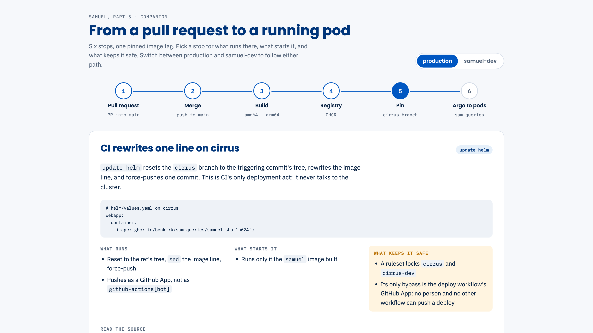

# Deployment & Operations

From a commit to a pod, and keeping it there.

## The whole pipeline {.vcenter}

::: {.notes}
Read it clockwise from the PR. CI's only deployment act is to rewrite one image tag on a
machine-owned branch; everything after that is CIRRUS's GitOps. Argo CD notices the new pin and
rolls the pods. Neither GitHub nor a laptop ever talks to the cluster directly. sam-queries
docs/CIRRUS_PUBLISHING.md is the long form; the next slide links a walkthrough.
:::

```{dot}
//| fig-width: 10
digraph Pipeline {
  graph [layout=neato, splines=true, bgcolor="transparent"];
  node  [shape=box, style="rounded,filled", fontname="Helvetica", fontsize=14,
         fillcolor="#FFFFFF", color="#6B7280", fontcolor="#00357A", margin="0.18,0.08"];
  edge  [fontname="Helvetica", fontsize=12, color="#6B7280", fontcolor="#6B7280"];
  pr    [label="a pull request", pos="0,1.9!"];
  ci    [label="GitHub Actions\ntests, build", pos="3,1.9!"];
  ghcr  [label="GHCR\nthe samuel image", pos="6,1.9!"];
  pin   [label="cirrus, cirrus-dev\nbranches", pos="9,1.9!"];
  argo  [label="Argo CD\non CIRRUS", pos="9,0!"];
  pods  [label="SAMuel pods\nnwc1", pos="6,0!", fillcolor="#0057C2", color="#00357A",
         fontcolor="#FFFFFF"];
  pg    [label="csg-postgres\n(CNPG)", pos="2.6,0.55!", shape=cylinder, fillcolor="#E6F0FA",
         color="#0057C2"];
  sql   [label="sam-sql\nMySQL VM", pos="2.6,-0.65!", shape=cylinder, fillcolor="#FFF4E0",
         color="#FAA119"];
  pr -> ci [label="merge"];
  ci -> ghcr [label="push"];
  ghcr -> pin [label="pin sha"];
  pin -> argo [label="watched by"];
  argo -> pods [label="sync"];
  pods -> pg;
  pods -> sql [label="SAM"];
}
```

## Walk the pipeline yourself

::: {.notes}
The companion page: the same six stops, one at a time, with a production / samuel-dev toggle.
Each stop says what runs, what starts it and what keeps it safe, and links the workflow YAML and
docs on sam-queries main. Shown here on the Pin stop. A snapshot as of 2026-10-01; the links
track main. The source, and how to republish it, is companion/ in this directory.
:::

[{height="72%" fig-align="center"}](https://claude.ai/artifact/Tp4XaBDH7BmvUbPT6UUbtS)

# From commit to image

Fourteen workflows, one image, two architectures.

## Branch flow {.vcenter}

::: {.notes}
Every feature PR targets staging. A merge there builds an image and pins cirrus-dev, so
samuel-dev follows staging about ten minutes later. The same push opens or refreshes the one
staging-to-main promotion PR (open-staging-promotion). Merging that pushes main, which pins
cirrus: production. sync-staging-to-main then resets staging onto main, so the two never drift.
:::

```{dot}
//| fig-width: 10
digraph Branches {
  graph [layout=neato, splines=true, bgcolor="transparent"];
  node  [shape=box, style="rounded,filled", fontname="Helvetica", fontsize=14,
         fillcolor="#FFFFFF", color="#6B7280", fontcolor="#00357A", margin="0.18,0.08"];
  edge  [fontname="Helvetica", fontsize=12, color="#6B7280", fontcolor="#6B7280"];
  feat    [label="feature branch", pos="0,1.3!"];
  staging [label="staging", pos="3.3,1.3!", fillcolor="#E6F0FA", color="#0057C2"];
  promo   [label="promotion PR\n(one, always open)", pos="6.6,2.6!"];
  main    [label="main", pos="9.9,1.3!", fillcolor="#E6F0FA", color="#0057C2"];
  dev     [label="cirrus-dev\nsamuel-dev", pos="3.3,0!"];
  prod    [label="cirrus\nproduction", pos="9.9,0!", fillcolor="#0057C2", color="#00357A",
           fontcolor="#FFFFFF"];
  feat -> staging [label="PR"];
  staging -> promo [label="opens, refreshes"];
  promo -> main [label="merge"];
  main -> staging [style=dashed, label="sync resets staging"];
  staging -> dev [label="pins"];
  main -> prod [label="pins"];
}
```

## Fourteen workflows {.smaller .center .fill scale="1.05"}

| Workflow | Does | Runs on |
|----------------------------------|----------------------------------------|----------------|
| `sam-ci-docker` | MySQL, Postgres and perf suites | PRs, main |
| `browser-smoke` | every dashboard in Chromium | PRs |
| two install workflows | install paths, CLI smoke | PRs |
| `ci-staging`, `mega-linter` | secrets, linters, Terraform, Helm | PRs |
| `build-images-cirrus-deploy` | build `samuel`, pin a cirrus branch | main, staging |
| two promotion workflows | one staging-to-main PR; reset staging | staging, main |
| four cleanup workflows | prune images, runs and logs | scheduled |
| `deploy-staging` | the retired AWS deploy | by hand |

::: {.notes}
sam-queries .github/workflows/,  files on origin/staging, 2026-10-01.
"PRs" means PRs into main, staging or integration; ci-staging takes PRs to staging, mega-linter
PRs to main. The install pair is sam-ci-conda_make and test-install. The promotion pair is
open-staging-promotion (push to staging) and sync-staging-to-main (promotion merged). The
cleanup four are clean-ghcr (Sundays), _prune-workflow-runs (reusable), cron-clean-action-log
(11th of the month) and manually-clean-action-log. The deploy workflow also runs by hand.
deploy-staging deployed the retired AWS ECS staging; its push trigger was removed 2026-09-04.
clean-ghcr keeps anything a kept multi-arch index references (#670).
:::

## What a PR must pass {.vcenter scale="1.15"}

- **Three test jobs, in parallel:** MySQL with coverage, Postgres, and the perf tier, on three
  runners that share one `test-stack` setup action.
- ** tests,** each in its own savepoint, so xdist workers share a
  database safely.
- **Around them:** a Chromium sweep of every dashboard, both install paths, TruffleHog for
  secrets, MegaLinter, and every Helm render.
- The split took the critical path from **15 minutes to under 10**.

::: {.notes}
sam-queries docs/plans/implemented/CI_PARALLEL_SPLIT.md (#677/#678): one job used to run tests
and then perf serially, and ci-staging repeated both suites on every staging PR. Measured run:
MySQL+coverage 578 s, Postgres 496 s, perf 416 s; coverage gates at 85%. The Helm renders include
helm/tests/test-dev-render.sh, which proves dev shares nothing with prod (later in this part).
:::

## One image, two architectures {.vcenter scale="1.15"}

:::: {.columns}
::: {.column width="55%"}
**How it builds**

- Native amd64 and arm64 runners, no emulation.
- Each pushes by digest. A merge job joins exactly two digests into one multi-arch tag, or
  fails.
- Peer plugins are pinned to commit SHAs, resolved once, so both builds see the same inputs.
:::
::: {.column width="45%"}
**What it bought**

- Size: ** to ** (uncompressed,
  arm64).
- Build: ** to ~
  minutes.**
- One image for the web pods, the CronJob, and the HPC hosts.
:::
::::

::: {.notes}
sam-queries docs/plans/implemented/JOBS_IMAGE.md (#660 to #672). The slim runtime stage on
python-slim was most of the size win; native runners were most of the time win. The peer plugins
are hpc-usage-queries and NCAR/hpc-scheduling-tools; if resolving a SHA fails, setup warns and
falls back to main. Only samuel builds by default; the mysql and samuel-dev images are
dispatch-only.
:::

# GitOps on CIRRUS

CI writes one line; CIRRUS's Argo CD does the rest. Thanks, CIRRUS.

## CI edits one line {.vcenter .fill scale="1.15"}

```yaml
# helm/values.yaml, on the cirrus branch
webapp:
  container:
    image: ghcr.io/benkirk/sam-queries/samuel:sha-1b624fc
```

- `update-helm` resets the `cirrus` branch to the triggering commit's tree, rewrites that line,
  and force-pushes **one** commit.
- A ruleset locks `cirrus` and `cirrus-dev`. Its only bypass is a GitHub App the workflow uses,
  so no human, and no other workflow, can push a deploy.

::: {.notes}
sam-queries docs/CIRRUS_PUBLISHING.md: the cirrus branches are machine-maintained pointers, not
for human edits. The App is cirrus-benkirk-deployer; the ruleset is "Lock cirrus to deploy
workflow". Because the branch is rebuilt from the triggering tree, the chart Argo sees is always
the chart at that commit, plus the new tag.
:::

## The publish pipeline {.vcenter}

::: {.notes}
.github/workflows/build-images-cirrus-deploy.yaml has five jobs: setup, build (a matrix of
image × platform), merge, summary and update-helm. Prod is never inferred: only a push to main
or a v* tag selects it on its own. GHCR tags are `sha-<short>`, the branch, semver on tags, and
latest on main only. (CIRRUS_PUBLISHING.md says "four jobs"; it is on the fix-later list.)
:::

```{dot}
//| fig-width: 10
digraph Publish {
  graph [rankdir=LR, nodesep=0.35, ranksep=0.55, bgcolor="transparent"];
  node  [shape=box, style="rounded,filled", fontname="Helvetica", fontsize=14,
         fillcolor="#FFFFFF", color="#6B7280", fontcolor="#00357A", margin="0.15,0.07"];
  edge  [fontname="Helvetica", fontsize=12, color="#6B7280", fontcolor="#6B7280"];
  tmain  [label="push to main,\nor a tag"];
  tstage [label="push to staging"];
  tdisp  [label="dispatch\n(dev by default)"];
  setup  [label="setup\ntarget, SHAs"];
  amd    [label="build\namd64"];
  arm    [label="build\narm64"];
  merge  [label="merge\none index"];
  ghcr   [label="GHCR\nsha, branch, latest"];
  helm   [label="update-helm"];
  prod   [label="cirrus\nproduction", fillcolor="#0057C2", color="#00357A",
          fontcolor="#FFFFFF"];
  dev    [label="cirrus-dev\nsamuel-dev", fillcolor="#E6F0FA", color="#0057C2"];
  {tmain tstage tdisp} -> setup;
  setup -> {amd arm};
  {amd arm} -> merge;
  merge -> ghcr;
  merge -> helm;
  helm -> prod [label="prod"];
  helm -> dev [label="dev"];
}
```

## Deploying to dev from any branch {.vcenter scale="1.15"}

- **`workflow_dispatch`** builds any branch. The target is `dev` by default, and `prod` only
  when asked for by name.
- That puts a PR's code on samuel-dev before it merges: useful for anything the test suite
  can't see, like OIDC, ingress or real data volumes.
- **The catch:** the deploy carries *that branch's* `helm/values.yaml`, not staging's. Keep the
  branch rebased on staging, or dev quietly loses a staging-only chart change.

::: {.notes}
`gh workflow run "Publish Images and CIRRUS Deploy" --ref <branch>`. The catch comes from
update-helm resetting the cirrus branch to the triggering ref's tree: a branch cut before a
chart change deploys the chart without it. It bit #367. The next staging push puts dev back.
:::

## Two Argo apps {.smaller .center .fill scale="1.1"}

| | prod | dev |
|------------------------|------------------------------|--------------------------------------|
| **App, namespace** | `sam-query`, `sam-queries` | `sam-query-dev`, `sam-queries-dev` |
| **Chart values** | `values.yaml` | `values.yaml` + `values-dev.yaml` |
| **SAM database** | `sam-sql` (MySQL VM) | `sam_dev` on `csg-postgres` |
| **Replicas** | , with a disruption budget |  |
| **Mail, XRAS, Jira** | on | off |
| **Tasks switched off** | 2 | 5 |
| **Redis** |  MB | 64 MB |

::: {.notes}
sam-queries docs/plans/implemented/K8S_DEV_ENVIRONMENT.md and helm/values-dev.yaml. Dev's tasks
off: expiration_notices, xras_notices, xras_sweep, account_requests_reconcile and
account_queue_digest; prod's off: xras_notices and account_queue_digest. Dev also gets its own
system_status_dev, so its task ledger never settles a prod slot. Same chart, same image
pipeline: dev is prod with the levers pulled.
:::

## The HPC hosts, too {.vcenter scale="1.15"}

- The same `samuel` image also runs on casper and derecho: the status collectors and the
  accounting jobs from Part 4.
- HPC deployments from staging and main are also straightforward.

::: {.notes}
Part 4 covers what those jobs do and when. This part is about where the web application runs.
:::

# Runtime on nwc1

Two pods, a cache, a CronJob, and nine secrets.

## What's in the namespace

::: {.notes}
helm/templates/. Blue is SAMuel's own code; the cache and secrets are platform parts. Secrets come
from CIRRUS's OpenBao through the External Secrets operator, never from the repo. The CronJob
runs the same image with a different entrypoint (sam-admin tasks --run-due).
:::

```{dot}
//| fig-width: 10
digraph Namespace {
  graph [rankdir=LR, nodesep=0.35, ranksep=0.7, bgcolor="transparent", fontname="Helvetica",
         fontsize=13, fontcolor="#6B7280"];
  node  [shape=box, style="rounded,filled", fontname="Helvetica", fontsize=14,
         fillcolor="#FFFFFF", color="#6B7280", fontcolor="#00357A", margin="0.15,0.07"];
  edge  [fontname="Helvetica", fontsize=12, color="#6B7280", fontcolor="#6B7280"];
  users [label="browsers,\nAPI callers"];
  bao   [label="OpenBao"];
  subgraph cluster_ns {
    label="namespace sam-queries"; style="rounded,dashed"; color="#9CA3AF";
    ing   [label="ingress\ntwo hostnames, one cert"];
    pod1  [label="samuel pod\ngunicorn gthread", fillcolor="#0057C2", color="#00357A",
           fontcolor="#FFFFFF"];
    pod2  [label="samuel pod\ngunicorn gthread", fillcolor="#0057C2", color="#00357A",
           fontcolor="#FFFFFF"];
    redis [label="Redis\ncache, limiter"];
    cron  [label="samuel-tasks\nCronJob", fillcolor="#E6F0FA", color="#0057C2"];
    es    [label="9 ExternalSecrets"];
  }
  sql [label="sam-sql", shape=cylinder, fillcolor="#FFF4E0", color="#FAA119"];
  pg  [label="csg-postgres", shape=cylinder, fillcolor="#E6F0FA", color="#0057C2"];
  users -> ing;
  ing -> {pod1 pod2};
  {pod1 pod2} -> redis;
  {pod1 pod2 cron} -> sql;
  {pod1 pod2 cron} -> pg;
  bao -> es [style=dashed];
}
```

## Rolling without a gap {.vcenter scale="1.15"}

- **Two replicas.** A rollout adds one new pod before it removes an old one, and never drops
  below two Ready.
- **A disruption budget** keeps one serving through node drains. The pods spread across nodes.
- **Each pod:** `gunicorn` `gthread`, 9 workers × 8 threads. A slow scan holds a thread, not a
  process.
- **Readiness gates on the `sam` database only.** A secondary database down reads `degraded`,
  still serving (Part 3).

::: {.notes}
helm/values.yaml: replicaCount 2, maxUnavailable 0, maxSurge 1, PodDisruptionBudget
minAvailable 1, topology spread maxSkew 1 on hostname (ScheduleAnyway). Workers default to
2×CPU+1, 9 at the 4-CPU request. The readiness rule is Part 3's CNPG story: a shared external
database failing every replica's /ready at once would empty the Service.
:::

## Ingress and secrets {.vcenter scale="1.15"}

:::: {.columns}
::: {.column width="50%"}
**Ingress**

- `samuel.k8s.ucar.edu`, the platform name.
- ****, a CNAME to it.
- One InCommon multi-SAN certificate covers both; no redirect between them.
- Class `nginx-external`.
:::
::: {.column width="50%"}
**Secrets**

- ** ExternalSecrets**, all through one read-only store.
- Databases (four), JupyterHub, XRAS, Jira, OIDC, the human check.
- Dev holds ****: no XRAS key, no Jira token.
:::
::::

::: {.notes}
helm/values.yaml tls.fqdn and tls.extraHosts; helm/templates/external_secret.yaml. The four
database secrets are the status DB, SAM, job history and fs-scans. Dev not holding the XRAS key
is deliberate: that key is write-provisioned, and a person merge deletes an account in
production with no undo.
:::

## Redis: a cache you can lose {.vcenter scale="1.15"}

- ** MB,** least-recently-used eviction, **no persistence**: a restart
  starts cold, and nothing breaks.
- **Database 0** is the page and chart cache. **Database 1** is the rate limiter.
- One replica. Losing it costs latency, not correctness.
- The one watch script that can purge it does so only with `--yes`.

::: {.notes}
helm/values.yaml cache: redis:7-alpine, maxmemoryMB 192 (limit 320Mi), allkeys-lru, save "".
Before changing the size, check evicted_keys: the eviction delta is the real cache signal, not
the memory percentage. scripts/cirrus_redis_purge.sh dry-runs by default.
:::

## The tasks CronJob {.vcenter scale="1.15"}

- **`samuel-tasks`** wakes at `7,22,37,52` past each hour, UTC, and never overlaps itself.
- It runs every task that is due: ** tasks**, each on its own
  schedule.
- A `task_run` ledger claims each slot once, so a retry or a late wake can't run it twice.
- Killed after 14 minutes, before the next wake.

::: {.notes}
helm/values.yaml tasks: concurrencyPolicy Forbid, timeZone Etc/UTC (no DST gap or fold),
activeDeadlineSeconds 840, backoffLimit 0. The wake minutes are arbitrary; the ledger keys off
each task's schedule. State machine: sam-queries docs/plans/implemented/SCHEDULED_TASKS.md.
:::

## The CronJob's three traps {.vcenter scale="1.15"}

- **The off-list is fail-open.** A new task goes live in production on the next wake, unless
  it is named in `SAM_TASKS_DISABLED` in the same change.
- **Mail settings must reach the CronJob explicitly.** It does not inherit the web pods'
  environment. Missing, every send is suppressed, and the Job still goes green.
- **The lease must outlive the kill.** Otherwise a killed send is reclaimed while it is still
  sending, and every PI gets a second copy.

† Each trap now has a test that reads or renders the chart.

::: {.notes}
CLAUDE.md "The account-request tasks". The lease is max(3 × expected_runtime, 900 s) and must
exceed activeDeadlineSeconds (840): a drift test parses values.yaml and asserts it. The mail
check is a per-manifest render assertion in helm/tests/test-cronjob-render.sh, because a
whole-render grep passes on the Deployment's copy and proves nothing.
:::

# The companion CNPG cluster

csg-postgres: job history, scans, status, and samuel-dev.

## `csg-postgres` at a glance {.vcenter scale="1.15"}

:::: {.columns}
::: {.column width="50%"}
**Shape**

- CloudNativePG, PostgreSQL ****.
- ** instances:** a primary and a replica, 512Gi each.
- A read-write service at the primary, and a read-only one at the replica.
- Lives in the `hpc-usage-queries` repo; Argo renders its chart.
:::
::: {.column width="50%"}
**Settings**

- Up to 4 CPUs and 64Gi each.
- 300 connections, 32 GB shared buffers.
- Idle sessions closed after 10 minutes.
- Slow statements (over 2 s) logged; `pg_stat_statements` on.
- TLS 1.3; Mountain time.
:::
::::

::: {.notes}
Peer repo hpc-usage-queries helm/ (chart cirrus-csg-postgres). The CPU limit came down from 8
to 4 in #113. Because Argo renders the chart, helm list shows nothing, and merging a chart
change rolls the cluster: #113 merged at 03:11Z and the pods were recreated at 03:22Z.
:::

## What it hosts {.smaller .center .fill scale="1.15"}

| Database | Written by | Read by |
|------------------------------|------------------------------|------------------------------|
| `derecho_jobs`, `casper_jobs` | `jobhist-sync` | My Jobs, via the replica |
| `campaign`, `destor` | the weekly scans rebuild | My Data, via the replica |
| `system_status` | SAMuel and the collectors | the Status dashboard |
| `system_status_dev`, `sam_dev` | samuel-dev; `make refresh-dev` | samuel-dev |

::: {.notes}
`system_status` is the only database here that can't be rebuilt from somewhere else: the job
and scan databases re-derive from PBS logs and filesystem scans, and the dev databases are
copies. It is also the one SAMuel writes on the primary, which is why Part 3's 2026-09-13 roll
mattered.
:::

## How it rolls {.vcenter scale="1.15"}

- **Switchover, not restart:** a planned roll promotes the replica first, then updates the old
  primary.
- **Measured:** a switchover gap **under **; an unplanned
  failover about ****.
- SAMuel rides both, because only the `sam` database gates readiness (Part 3).
- **Backups:** volume snapshots are configured; scheduled backups to Boreas are planned.

::: {.notes}
hpc-usage-queries #114: primaryUpdateMethod switchover, switchoverDelay 60, smartShutdownTimeout
30. Measured 2026-09-13; a whole roll takes about a minute. Part 3 has the PSA that led here.
Monitoring is the peer repo's scripts/cnpg_watch.sh and its watch-cnpg skill (later in this
part).
:::

# Dev vs prod

A laptop, samuel-dev, production, and who watches them.

## Three places SAMuel runs {.smaller .center .fill scale="1.1"}

| | Laptop | samuel-dev | Production |
|--------------|--------------------------|--------------------------|--------------------------|
| **Where** | Docker Compose | CIRRUS, `sam-queries-dev` | CIRRUS, `sam-queries` |
| **Address** | `localhost:5050` |  |  |
| **SAM data** | obfuscated MySQL snapshot | `sam_dev`, a copy | the real thing |
| **Sign-in** | stub login | Entra ID | Entra ID |
| **Mail out** | never | never | yes |
| **Follows** | your working tree | staging | main |

::: {.notes}
compose.yaml; helm/values-dev.yaml. Every dev environment runs an obfuscated production
snapshot, and the mail relay would reach any address on the internet, which is why mail is
fail-closed everywhere but the prod chart. samuel-dev's data is refreshed by make refresh-dev;
its writes are discarded on the next refresh.
:::

## Compose on a laptop {.smaller .center .fill scale="1.15"}

| Service | Profile | Port | For |
|------------------|-----------|--------|--------------------------------------|
| `samuel` | default | 7050 | the production image |
| `samuel-dev` | default | 5050 | the dev image, code-synced (`--watch`) |
| `cache` | default | 6379 | Redis |
| `mysql` | default | 3306 | the obfuscated snapshot |
| `mysql-test` | test | 3307 | the only database tests may touch |
| `postgres-test` | test | 5434 | the Postgres suite |
| `postgres` | pg | 5433 | a local Postgres SAM |

::: {.notes}
sam-queries compose.yaml. tests/conftest.py refuses any database but the allowlisted
mysql-test container on 3307. The mysql image carries the snapshot as a Git LFS blob.
:::

## samuel-dev: prod's chart, none of its reach {.vcenter scale="1.15"}

- **The same chart and image pipeline,** with `values-dev.yaml` on top: one replica,
  Postgres, its own status database.
- **The levers are off:** mail, XRAS outgoing and writes, Jira. Inbound XRAS is
  capture-only.
- **`make refresh-dev`** rebuilds its data from a fresh snapshot.
- **The guarantee is a test:** `helm/tests/test-dev-render.sh` renders dev and fails if it
  shares a secret, host, database or lever with prod.

::: {.notes}
sam-queries docs/plans/implemented/K8S_DEV_ENVIRONMENT.md. Limiter tiers are off on dev except
login, so a load test there looks like real load. The test asserts that dev is authenticated,
mute, on its own data and disjoint from prod, then proves each check can fail by re-rendering
with one prod value at a time. ci-staging runs it (make helm-test) on every PR to staging.
:::

## Watching it: the scripts {.vcenter scale="1.15"}

- **`cirrus_healthcheck.sh`:** a read-only probe of the release, start to finish.
- **`cirrus_watch.sh`:** a tick that prints only what changed since the last one: web,
  latency, cache, pods, CronJob, XRAS.
- **`cirrus_weblog_audit.sh`:** traffic, rate limits, and security failures.
- **`cirrus_redis_purge.sh`:** dry-run by default. The only one that changes anything, and only
  with `--yes`.

† All four take `--env dev`.

::: {.notes}
sam-queries scripts/cirrus_*.sh. cirrus_watch.sh exits 0 quiet, 1 warn, 2 fail, so a scheduler
can alert on it, and keeps its state outside the repo. A dropped VPN makes a tick a clean no-op,
not a fault.
:::

## Claude on watch: the skills {.smaller .center .fill}

| Skill | Load it | It drives | It reports |
|----------------------|------------------------|------------------------------|------------------------------|
| `watch-prod` | for a recurring prod watch | `cirrus_watch.sh` on a timer | changes only; a quiet hour is one line |
| `watch-dev` | after a staging merge | `cirrus_watch.sh`, with `--env dev` | did the pin roll, is dev healthy |
| `profile-dev` | for a load or latency pass | a real signed-in session, at concurrency | where the time went: database, plugin, or Python |
| `watch-cnpg` | for a cluster watch (peer repo) | `cnpg_watch.sh` | failovers, connections, lag, slow queries |

::: {.notes}
sam-queries .claude/skills/{watch-prod,watch-dev,profile-dev}/SKILL.md; watch-cnpg lives in
hpc-usage-queries. The skills carry the judgment the scripts can't: what a line means, what to
flag and what to let ride, the known-slow endpoints not to re-flag, and a rule against starting
a duplicate timer (one timer runs both the prod and dev ticks). They read and report; any change
to the cluster or the CronJob is a human's call. profile-dev reads three sides at once (the load
driver, cirrus_watch --env dev, and cnpg_watch) and attributes each slow request from its logged
per-database timing split.
:::

## TL;DR - deployment & operations {.vcenter scale="1.15"}

- **A merge is a deploy:** staging to samuel-dev, main to production, by one pinned image tag.
- **CI never touches the cluster.** It edits one line on a locked branch; CIRRUS's Argo CD does
  the rest.
- **One multi-arch image** for the pods, the CronJob, and the HPC hosts.
- **Two pods, a cache you can lose,** and a ledger-backed CronJob with three known traps.
- **`csg-postgres`** holds everything but production SAM, and rolls without a gap.
- **Dev is prod's chart with the levers off,** and a test proves it.
