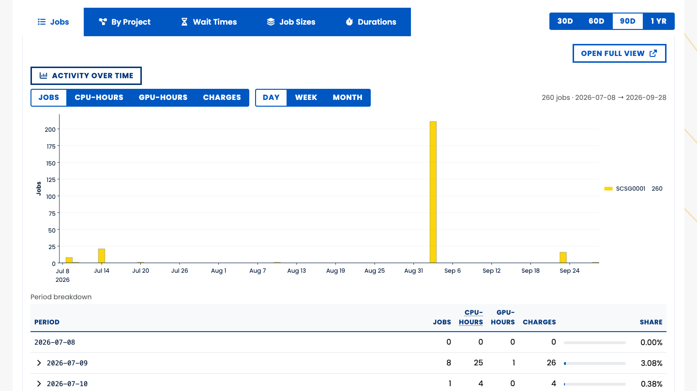
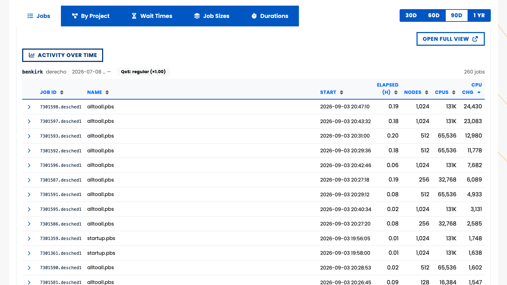
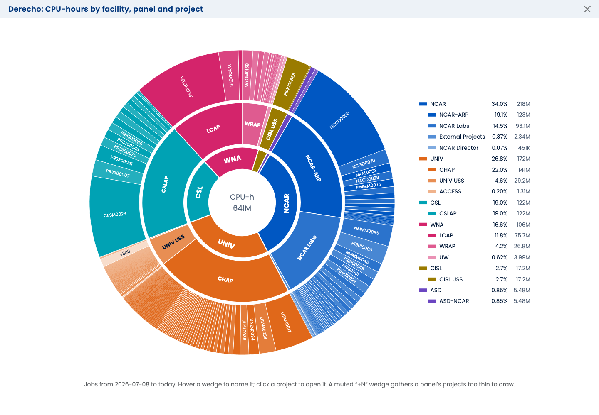
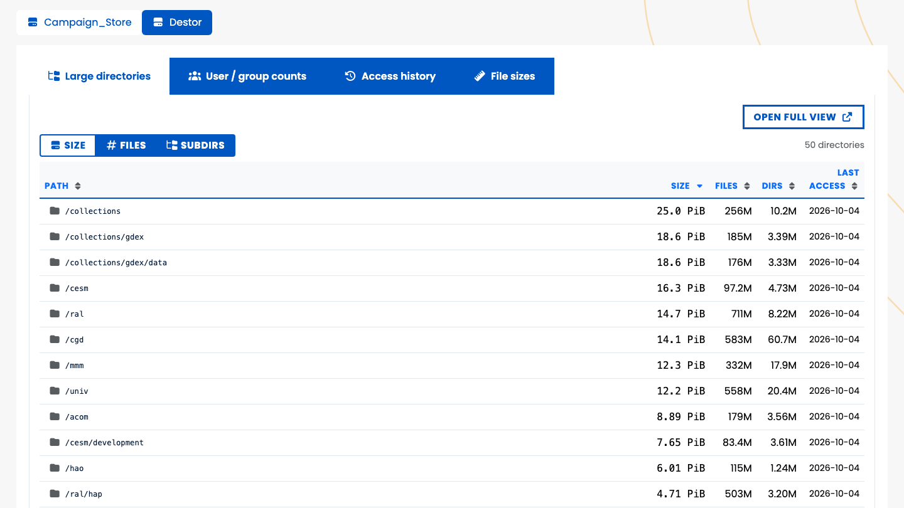

# Where the Hours Went

Your jobs and your files, read from the databases next door.

## Two questions users ask {.vcenter scale="1.15"}

- **Where did my hours go?** My Jobs: every job on Derecho and Casper, charted and searchable.
- **What is filling my space?** My Data: the weekly scans of Campaign Store and Destor, by
  directory.
- **Both are plugins.** Without one, its tab is simply not there, and the app still boots.
- **Both show only you.** The server fixes the user; a different one in the URL is ignored.
  Whole-machine views need a staff permission.

::: {.notes}
My Jobs: /user/jobs (src/webapp/dashboards/user/blueprint.py:198-210), 404 when no machine engine
is warm. My Data: /user/data (blueprint.py:106-109,173-180), 404 without a unix_uid or a
scan-capable resource. User mode pins the username or uid server-side and ignores ?user= and
?owner_uid= (src/webapp/jobs/routes.py:1774-1777, src/webapp/disk_scans/routes.py:772-807).
Staff views: VIEW_ALL_JOB_DATA (/status/job-history) and VIEW_ALL_FILESYSTEM_DATA
(/status/filesystem-scans). Plugin absent: the import failure is logged and enabled stays False
(src/webapp/plugins/base.py:64-78); the nav items and status tabs hide
(templates/dashboards/user/base_user.html:21-24); the CLI prints the install hint
(src/cli/core/base.py:41-58).
:::

## My Jobs: three months at a glance

::: {.notes}
Ben's own Derecho jobs, the default 90-day window: 260 jobs. The spike on 2026-09-03 is an
all-to-all scaling test (next slide). Pills switch the metric (jobs, CPU-hours, GPU-hours,
charges) and the period (day, week, month); the window is 30, 60 or 90 days or a year
(src/webapp/jobs/service.py:35,40; an unknown ?days= falls back to 90, routes.py:123-135). Taken
locally against a copy of the job-history database, logged in as Ben; only his own jobs show.
:::

[{height="72%" fig-align="center"}](https://sam.hpc.ucar.edu/user/jobs)

## Every job, one row

::: {.notes}
The same page, sorted by CPU charge: the 2026-09-03 spike was alltoall.pbs at 128 to 1,024 nodes
(131K cores). Default columns: routes.py:74-78; columns that are all zero are hidden
(routes.py:102-107). The row's drawer adds exit status, queue, submit/end/walltime, MPI ranks and
threads, memory, CPU/GPU types and memory charges (routes.py:89-99). 50 rows a page by default, up
to 200 (routes.py:110, src/webapp/utils/htmx.py:165-167). Facet chips filter by queue, QoS and
exit status, with live counts (service.py:575-581).
:::

[{height="72%" fig-align="center"}](https://sam.hpc.ucar.edu/user/jobs)

## Six ways to look at the same jobs {.smaller .center .fill}

| View | Shows |
|---------------|------------------------------------------------------------------|
| **Jobs** | the table, with the activity chart above it and facet chips for queue, QoS and exit status |
| **By User** | who used the hours (project and machine views only) |
| **By Project** | which projects used them, as rings by facility, or full screen by facility, panel and project |
| **Wait Times** | how long jobs queued before they started |
| **Job Sizes** | nodes, CPUs, GPUs, and memory requested, used and wasted |
| **Durations** | how long jobs ran |

† The same views serve a user, a project and a whole machine; only the scope changes.

::: {.notes}
One panel registry, three modes: user (login only), project (require_project_access) and machine
(VIEW_ALL_JOB_DATA). 3 modes x 8 panels via register_panels (src/webapp/jobs/routes.py:2085-2151;
the panel list at :2119-2146). User mode drops By User ("a pie of one") and By Project takes its
slot. Job Sizes is the only panel with dimension pills: nodes, cpus, gpus, memory, memory_used,
memory_wasted (routes.py:454-455). The timeline is not a tab: it renders inside the Jobs pane,
behind a collapse.
:::

## A whole machine, by project

::: {.notes}
Status, Job History, Derecho, By Project, CPU-hours, opened full screen with the expand icon: facilities
inside, allocation panels in the middle, every project on the rim, with a "+N" wedge for the ones too
thin to draw. Staff only (VIEW_ALL_JOB_DATA). Project codes, no people. Taken locally against a copy
of the job-history database, 2026-10-06. Design record: docs/plans/PANEL_SUNBURST.md.
:::

{height="72%" fig-align="center"}

## My Data: what is filling my space {.smaller .center .fill}

| Tab | Shows |
|---------------------|-------------------------------------------------------------|
| **Large directories** | path, size, files, subdirectories and last access; 50 rows, up to 500, by any column |
| **Access history** | your data grouped by when each directory was last touched |
| **File sizes** | how your data and files split by average file size |
| **User / group counts** | who owns what (project and filesystem views only) |

† Counted per directory, not per file: the scans don't track single files.

::: {.notes}
src/webapp/disk_scans/: modes project (require_project_access), resource
(VIEW_ALL_FILESYSTEM_DATA) and user (login only, owner pinned to current_user.unix_uid,
routes.py:772-807). Tabs: templates/.../disk_scans_card.html:2,76,89,101; User / group counts is
hidden in user mode (routes.py:822-827). Columns: disk_scans_directories.html:37-43; sort keys
size, files, dirs, atime, path (routes.py:74-76); 50 by default, up to 500 (routes.py:78-81,
106-112). Access history uses 10 bands, "< 1 Month" to "7+ Years" (FS_SCANS_WEBUI.md:30). The
page's own notes: "computed by directory and grouped by most recent access" and "approximate,
computed as average file sizes per directory". Filesystems: FS_SCAN_RESOURCES defaults to
Campaign_Store and Destor (src/webapp/config.py:290-293). The next slide shows the same panels for a
whole filesystem: Ben's own My Data is a few files.
:::

## The same panels, a whole filesystem

::: {.notes}
Status, Filesystem Scans, Campaign Store, Large directories (VIEW_ALL_FILESYSTEM_DATA): the
panels My Data shows a user, for the whole filesystem. Production, read-only, 2026-10-06. Names and emails are replaced with pseudonyms in the page before capture, never blurred (docs/plans/SAMUEL_PROD_SCREENSHOTS_HANDOFF.md).
:::

[{height="72%" fig-align="center"}](https://sam.hpc.ucar.edu/status/filesystem-scans)

## Where the data comes from {.smaller .center .fill}

| | My Jobs | My Data |
|-------------|----------------------------------|---------------------------------|
| **Database** | `derecho_jobs`, `casper_jobs` | `campaign`, `destor` |
| **Size** | about 16M and 27.5M jobs | about 61M directory rows |
| **Fresh** | synced every 5 minutes | scanned weekly |
| **Read by** | the plugin's ORM, not REST | the plugin's own sessions |
| **Cached** | 15 min (today) or 30 min (older) | until the next scan, 8 days at most |
| **Slow when** | a filter forces a full scan: ~7 s | a sub-path: 30 s and up |

† Both live on `csg-postgres` (Part 5). The plugins come from `hpc-usage-queries` (Appendix A).

::: {.notes}
Engines: one per machine (src/webapp/jobs/session.py:53-99; config.py:236-237) and one per
database x collection (src/webapp/disk_scans/session.py:63-120). Statement timeouts 60 s and
100 s (config.py:258-260, 282-284). Row counts as in Appendix C (_C-performance.qmd:282);
JOB_HISTORY_FOLLOWUPS.md:42,48 had 13M and 21M on 2026-07-27. Sync cadence: Part 4's schedule
(jobhist-sync rapid, every 5 minutes, plus daily and weekly upserts). Job caches: 900 s if the
window touches today, 1800 s otherwise; aggregations only (src/webapp/jobs/cache.py:14-16,38-49).
Scan caches: keys carry each collection's latest scan date, so a new scan invalidates them
(src/webapp/disk_scans/cache.py:37-48,62-76): 8 days for the default view, 30 min when filtered. Timeline fast path through daily_summary: 68 ms
on Derecho, 65 ms on Casper, about 7.4 s when filters force a scan (JOBS_TIMELINE.md:94-97).
A whole-collection root is sub-second; a sub-path takes 30-120 s or 30-200 s (two code comments
disagree, disk_scans/cache.py:9-11 and routes.py:19-22).
:::

## TL;DR - where the hours went {.vcenter scale="1.15"}

- **My Jobs** answers "where did my hours go?": six views, every job a row.
- **My Data** answers "what is filling my space?", from the weekly scans.
- **Both are plugins:** absent cleanly, and pinned to the signed-in user.
- **The data stays next door,** on `csg-postgres`, read directly and cached.
