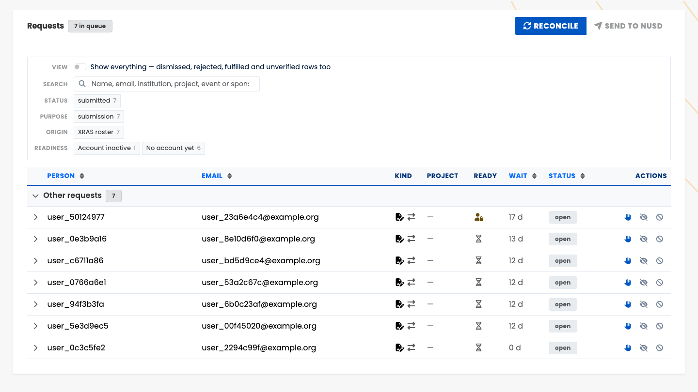
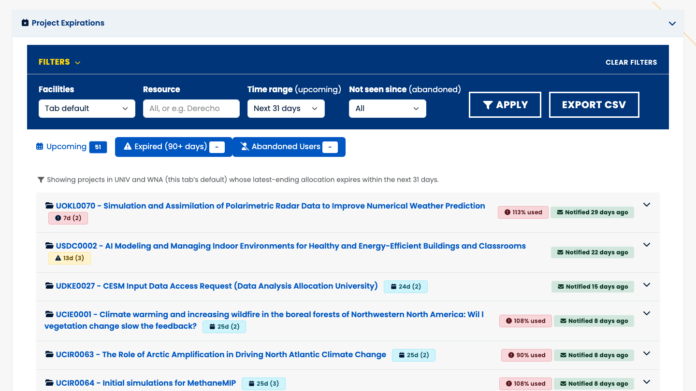
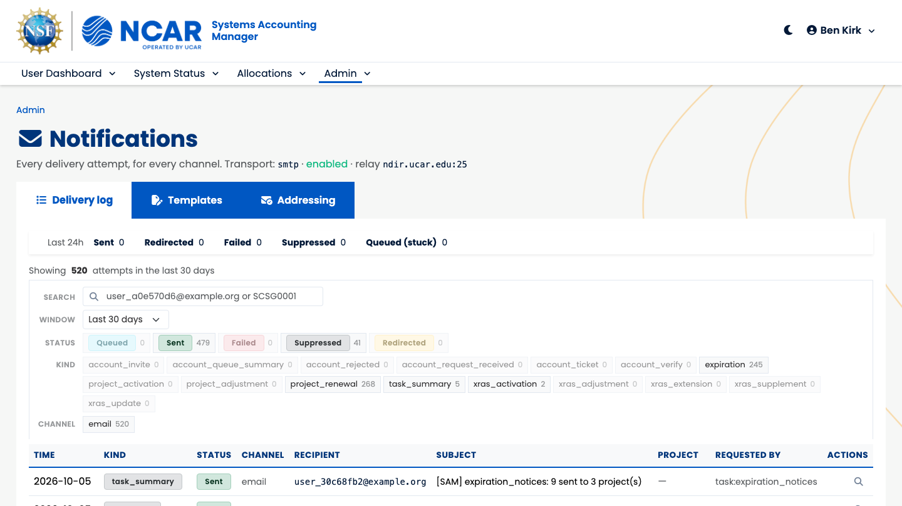
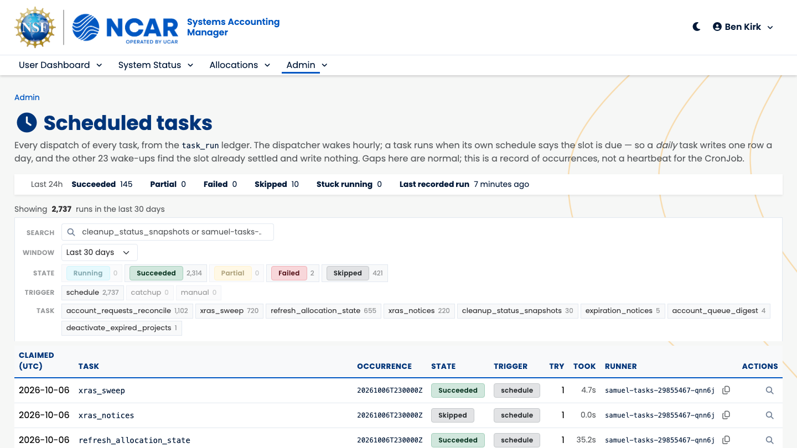
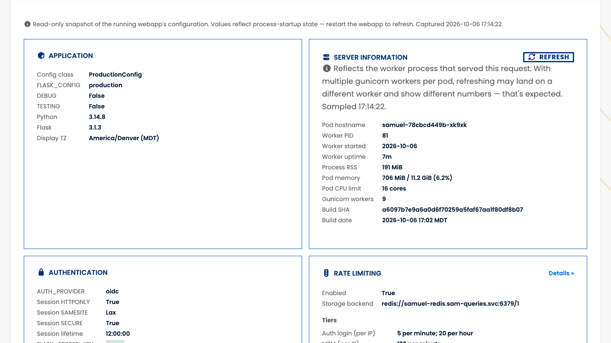
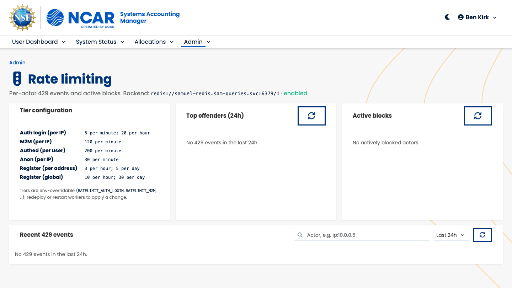
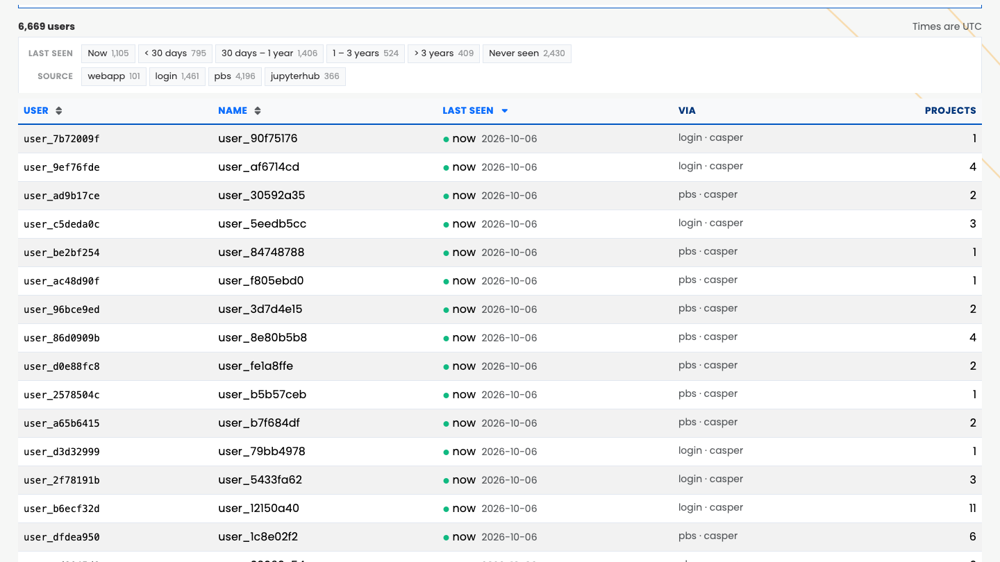

# Running the Shop

The admin dashboard, as the people who use it every day see it.

## A tour of the tabs {.smaller .center .fill}

| Tab | Who sees it | For |
|----------------------|------------------------------|-----------------------------------------|
| **Projects** | staff, facility managers | projects, members, allocations, expirations |
| **Users & Groups** | staff, facility managers | users, groups, who was seen lately |
| **Resources … Facilities** | staff, facility managers | what allocations hang on |
| **Account Requests** | NUSD | people who need an account |
| **Events** | CSG, facility managers | workshops and their enrollees |
| **Configuration** | staff, read-only | how this deployment is set up and doing |
| **Roles** | nobody, by default | who may do what |

::: {.notes}
"Resources … Facilities" is four tabs of reference data: Resources, Organizations, Contracts,
Facilities & Allocations. A facility manager sees only their facility's rows.
Blueprint admin_dashboard at /admin (src/webapp/dashboards/admin/blueprint.py:60); tab strip at
templates/dashboards/admin/base_admin.html:30-46. Gates: ACCESS_ADMIN_DASHBOARD with
require_permission_any_facility (src/webapp/utils/rbac.py:288) for the data tabs (blueprint.py:98-248);
MANAGE_ACCOUNT_REQUESTS (account_requests_routes.py:132-134, tab hidden without it); MANAGE_EVENTS,
facility-scoped through all_events(facility_names=...) (events_routes.py:33,68,81-82);
ACCESS_ADMIN_DASHBOARD plus VIEW_SYSTEM_CONFIG for Configuration (blueprint.py:256-259); MANAGE_ROLES
for Roles (roles_routes.py:75-78), withheld from every default role (src/sam/security/rbac_defaults.py:113).
Defaults: allocation_admin (NUSD) holds MANAGE_ACCOUNT_REQUESTS and IMPERSONATE_USERS
(rbac_defaults.py:38-42); MANAGE_EVENTS is CSG's (:73); facility_manager is granted per facility
(:50-56, 92).
:::

## Account requests: a queue, not an inbox {.vcenter scale="1.15"}

- A request is submitted, claimed, rejected or dismissed. "Fulfilled" is not a state: SAMuel
  finds the person in `users` by email.
- A reconcile task stamps fulfilled requests every 15 minutes, enrolls them, and purges unverified
  public requests after a week.
- An operator claims a request, vouches for the address, and SAMuel files one help-desk ticket for
  it, tagged `[SAM-AR-<id>]`. If the ticket service fails, the ticket goes by mail.
- Reject has a mail preview; every action runs in one audited transaction.

† In production the public form is off; people arrive through a sponsor's invitation or an event.

::: {.notes}
States: src/sam/core/account_requests.py:26; fulfilled is derived from users by email and only
reconcile_account_requests() writes it (CLAUDE.md, Account requests). A render never writes
(account_requests_routes.py:5-7). Actions, all MANAGE_ACCOUNT_REQUESTS inside management_transaction:
claim/unclaim (:229,:238), verify then file the ticket (:246-255), reopen (:258), dismiss/reject with a
reason, reject with a mail preview (:295-394), Reconcile now (:402-415), digest preview and send
(:432,:452). The task: account_requests_reconcile, CronExpr('*/15 * * * *')
(src/scheduling/tasks/account_requests_reconcile.py:28); SAM_TASKS_ACCOUNT_PURGE_DAYS=7
(helm/values.yaml:641). Ticket: account_ticket, one per request; send_ticket tries Jira Service
Management first and falls back to mail (src/webapp/register/handoff_mail.py:61-90). Prod flags
(helm/values.yaml): ACCOUNT_REGISTRATION_ENABLED "0" (:182), ACCOUNT_INVITATIONS_ENABLED "1" (:184),
TICKET_PROVIDER jira-servicedesk with JIRA_WRITE_ENABLED "1" (:408-410).
:::

## The queue

::: {.notes}
Admin, Account Requests: seven XRAS-roster requests waiting on an account, grouped, with facet
chips for status, purpose, origin and readiness. Production, read-only, 2026-10-06. Names and emails are replaced with pseudonyms in the page before capture, never blurred (docs/plans/implemented/SAMUEL_PROD_SCREENSHOTS_HANDOFF.md).
:::

[{height="72%" fig-align="center"}](https://sam.hpc.ucar.edu/admin/account-requests)

## Events and invitations {.vcenter scale="1.15"}

- An event is a workshop: create, edit, close, reopen. A listed event shows on the public Status
  page; an invite-only event closes every self-service path.
- Paste a roster to enroll a class at once, with a preview before anything is written.
- A sponsor's invitation is a signed link, good for 30 days. Resending it voids the older link.
- The link is the permission: it needs no login, because the invitee has no account yet.

::: {.notes}
Lifecycle MANAGE_EVENTS (events_routes.py:100-162), shared with a project's Invitations tab through
webapp/dashboards/event_lifecycle.py. listed and invite_only: account_requests.py:81-84. Roster paste:
form, preview, submit, gated on MANAGE_ACCOUNT_REQUESTS because a roster writes account requests
(events_routes.py:34,196-217). Invitation token: itsdangerous URLSafeTimedSerializer, salt
account-invite (src/webapp/register/tokens.py:22-30), bound to invite_sent_at, so a resend
invalidates older links (tokens.py:9-10, invite.py:43-60); ACCOUNT_INVITE_TTL_DAYS=30
(src/webapp/config.py:78). Records: docs/plans/implemented/ACCOUNT_REGISTRATION.md, EVENTS_VIEWS.md,
EVENTS_FOLLOWUPS.md, ACCOUNT_INVITE_LINKS.md.
:::

## Expirations: warn, then deactivate {.vcenter scale="1.15"}

- The Expirations section of the Projects tab lists what is about to expire, what has expired,
  and what looks abandoned, each exportable as CSV.
- Every Monday, PIs of projects about to expire get a notice.
- On the 3rd of each month, projects 90 days past their end are deactivated. The **Deactivate
  Expired** button does the same thing on demand.
- The button and the task use the same window and the same write, in one audited transaction.

::: {.notes}
Fragment /admin/expirations, VIEW_PROJECTS any-facility (blueprint.py:629-648); CSV
/admin/expirations/export with export_type upcoming, expired or abandoned (:784-805); the button,
POST /admin/expirations/deactivate-expired, EDIT_PROJECTS any-facility, inside management_transaction,
same window and write as the task (:716-745). DEACTIVATION_MIN_DAYS_EXPIRED = 90
(src/sam/queries/expirations.py:37). deactivate_expired_projects: MonthlyDay(3, 4, 30, America/Denver)
(src/scheduling/tasks/deactivate_expired.py:33), every facility (:39), 7-day misfire grace (:66),
inactivate_time from the scheduled time, not the clock (:7-11). Live in prod. expiration_notices:
Monday 09:00 MT (expiration_notices.py:57). Records: EXPIRATION_NOTICES.md.
:::

## What expires next

::: {.notes}
Admin, Projects, Project Expirations, Upcoming: UNIV and WNA projects whose last allocation ends
within 31 days, with how much they have used and when the PI was last notified. Project codes and
titles are real; no people show. Production, read-only, 2026-10-06. Names and emails are replaced with pseudonyms in the page before capture, never blurred (docs/plans/implemented/SAMUEL_PROD_SCREENSHOTS_HANDOFF.md).
:::

[{height="72%" fig-align="center"}](https://sam.hpc.ucar.edu/admin/projects)

## Mail that can't surprise you {.vcenter scale="1.15"}

- **Off unless switched on:** only production sends. A copy elsewhere can still reach the mail
  relay, and obfuscating its data doesn't change that.
- **Preview first:** every button that sends mail shows the exact message, recipients and copies,
  and when it was last sent.
- **Never twice:** each message carries a key; a repeat of a sent one is suppressed.
- **One ledger:** every attempt is recorded, sent, redirected, failed or suppressed, in five
  families: expiration, XRAS, tasks, accounts, project lifecycle.
- **Addressing rows** add copies per family or per facility, without a deploy.

::: {.notes}
NOTIFY_ENABLED defaults to false (CLAUDE.md, Notifications); only helm/values.yaml:264 sets "1"; dev
"0" (values-dev.yaml:45). Preview: webapp/utils/email_preview.py, through Notifier.preview_delivery()
on a read-only notifier (MAIL_PREVIEW.md); send points: XRAS and Project Notify, invite, resend,
roster x2, reject, digest, renew/extend. Dedup key from the intended, pre-redirect recipient; sent and
redirected suppress a repeat. Statuses: src/sam/notify/base.py:51-53. Families:
src/sam/notify/kinds.py:44-53; 16 kinds at :100-283. Addressing: notification_addressing rows, scope a
family, a kind or {kind}-{facility}, always adding (notifications_routes.py:470-517). The log names
real addresses, so its details page is SYSTEM_ADMIN (notifications_routes.py:7-13); the counts on the
Configuration tab are VIEW_SYSTEM_CONFIG (configuration_card.html:188-268).
:::

## The delivery log

::: {.notes}
Admin, Configuration, Notifications (SYSTEM_ADMIN): 520 attempts in 30 days, faceted by status,
kind and channel. Templates and Addressing are the other two tabs. Production, read-only, 2026-10-06. Names and emails are replaced with pseudonyms in the page before capture, never blurred (docs/plans/implemented/SAMUEL_PROD_SCREENSHOTS_HANDOFF.md).
:::

[{height="72%" fig-align="center"}](https://sam.hpc.ucar.edu/admin/htmx/notifications)

## Templates operators can edit {.vcenter scale="1.15"}

- The 33 email templates are editable in the browser, by a system admin.
- A save is stored as an override in the database, and the file stays as shipped. Reset deletes
  the override.
- Saving renders the template against sample data first, so a broken template is refused before
  anyone gets it.
- "Preview for" a real project shows what that project's PI would receive.

::: {.notes}
Admin, Configuration, Notifications, Templates (SYSTEM_ADMIN). Save writes notification_template_override
and renders against sam/notify/samples.py; reset deletes the row (notifications_routes.py:327-347). 39
files in src/sam/notify/templates, 6 of them underscore partials (developer-owned, never editable), so
33 editable (src/sam/notify/render.py:54-63); CLAUDE.md still says 30. The renderer prefers the
override on its next build, one SELECT per Notifier. Text selects the facility variant and HTML follows
it. Record: docs/plans/implemented/NOTIFICATION_TEMPLATE_EDITOR.md.
:::

## The tasks, from the dashboard {.smaller .center .fill}

| Task | When | In production |
|---------------------------------|--------------------------|----------------|
| `account_requests_reconcile` | every 15 minutes | on |
| `refresh_allocation_state` | hourly | on |
| `xras_sweep` | hourly | on |
| `cleanup_status_snapshots` | daily, 02:15 | on |
| `expiration_notices` | Mondays, 09:00 | on |
| `deactivate_expired_projects` | the 3rd, 04:30 | on |
| `account_queue_digest` | Mondays, 08:00 | off |
| `xras_notices` | business hours | off |

† Run history is read-only, with facet chips; a replay is `sam-admin tasks --run X --force`.

::: {.notes}
Schedules: cleanup_status.py:33, deactivate_expired.py:33, refresh_allocation_state.py:18,
xras_sweep.py:88, expiration_notices.py:57, account_requests_reconcile.py:28 (UTC), xras_notices.py:71
(BusinessHourly, Mountain), account_queue_digest.py:31; times are Mountain. Prod disables
xras_notices and account_queue_digest (helm/values.yaml:675). The list is fail-open: a new task runs in
prod unless named there in the same change (values.yaml:663-674). Dev also disables
expiration_notices, xras_sweep and account_requests_reconcile (values-dev.yaml:89). The run-history
page (/admin/htmx/tasks, VIEW_SYSTEM_CONFIG; detail SYSTEM_ADMIN) is built on src/querykit/, with no
"run now" button (tasks_routes.py:1-23). States: running, succeeded, partial, failed, skipped; triggers:
schedule, catchup, manual (src/system_status/models/task_run.py:33-36). --occurrence needs --force and
takes a separate M-prefixed run key, so a replay never claims a real slot; --force cannot override
SAM_TASKS_DISABLED (src/cli/cmds/admin.py:882-933). Record: SCHEDULED_TASKS_DASHBOARD.md.
:::

## Every run, on the record

::: {.notes}
The run history: 2,737 runs in 30 days, one row per dispatch that found its slot due. Production, read-only, 2026-10-06. Names and emails are replaced with pseudonyms in the page before capture, never blurred (docs/plans/implemented/SAMUEL_PROD_SCREENSHOTS_HANDOFF.md).
:::

[{height="72%" fig-align="center"}](https://sam.hpc.ucar.edu/admin/htmx/tasks)

## The Configuration tab {.vcenter scale="1.15"}

- One page for how this deployment is set up: authentication, mail, tickets, tasks, database
  pools, caches, the last lines of the audit log.
- Rate limits: recent 429s, the top offenders, and who is blocked now. A system admin can unblock.
- Last seen: when each user was last seen anywhere (web, login, PBS, JupyterHub), with buckets from
  "now" to "never". The same list is `sam-search user --abandoned`.
- An allocation admin can act as another user to see what they see, but never as someone with more
  rights.

::: {.notes}
Sections of configuration_card.html: Application (:38), Server Information (:66), Authentication
(:92), Rate limiting (:137), Notifications (:194), Roles & access (:276), Help-desk tickets (:327),
Scheduled tasks (:368), Database with pool stats (:463; config_inspect.py:86), Caching with invalidate
for SYSTEM_ADMIN (:541-544), Audit & Logging with the last 25 lines (:603; config_inspect.py:301).
Rate limits: the Redis event ring; unblock is SYSTEM_ADMIN and goes to the app log, not the audit log
(rate_limits_routes.py:1-15,113-140). Last seen: system_status.user_last_seen joined to users by
username (last_seen_routes.py:1-6); buckets (src/sam/queries/last_seen_review.py:48-54); sources
(src/system_status/models/last_seen.py:21); in prod since 2026-09-27, backfilled to 2011
(USER_LAST_SEEN.md:3-4); the CLI at src/cli/cmds/search.py:83-88. Impersonation: POST
/admin/impersonate, IMPERSONATE_USERS, refused for a target holding a permission the caller lacks
(blueprint.py:265-306); it does not count as the target being seen (USER_LAST_SEEN.md:11). Audit:
management_transaction (src/sam/manage/transaction.py:12) and a before_flush listener
(src/webapp/audit/events.py:1-35) write AUDIT_LOG_PATH (src/webapp/config.py:148-153).
:::

## The deployment, read-only

::: {.notes}
Admin, Configuration: the running pod's settings, captured at process start. Production, read-only, 2026-10-06. Names and emails are replaced with pseudonyms in the page before capture, never blurred (docs/plans/implemented/SAMUEL_PROD_SCREENSHOTS_HANDOFF.md).
:::

[{height="72%" fig-align="center"}](https://sam.hpc.ucar.edu/admin/configuration)

## Rate limits

::: {.notes}
The tiers in force, and a quiet day: no 429s in 24 hours, nobody blocked. Production, read-only, 2026-10-06. Names and emails are replaced with pseudonyms in the page before capture, never blurred (docs/plans/implemented/SAMUEL_PROD_SCREENSHOTS_HANDOFF.md).
:::

[{height="72%" fig-align="center"}](https://sam.hpc.ucar.edu/admin/htmx/rate-limits)

## Who was seen, and when

::: {.notes}
Admin, Users & Groups, Last seen: 6,669 active SAM users bucketed from "now" to "never seen",
and by source. Production, read-only, 2026-10-06. Names and emails are replaced with pseudonyms in the page before capture, never blurred (docs/plans/implemented/SAMUEL_PROD_SCREENSHOTS_HANDOFF.md).
:::

[{height="72%" fig-align="center"}](https://sam.hpc.ucar.edu/admin/users/last-seen)

## TL;DR - running the shop {.vcenter scale="1.15"}

- **Account requests are a queue:** claim, vouch, one ticket, fulfillment found by itself.
- **Expirations warn on Mondays** and deactivate on the 3rd, or now, at the button.
- **Mail can't surprise anyone:** off by default, previewed, never sent twice, all on a ledger.
- **Operators edit the templates;** developers own the layout.
- **Eight tasks, six on,** each one visible on the dashboard.
